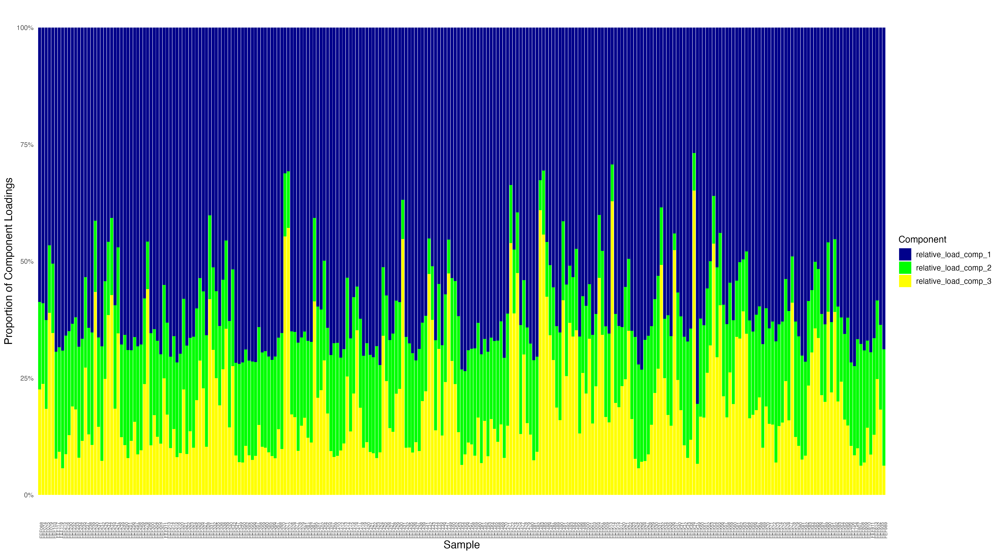

# Relating PARAFAC components to FEF watersheds: Correlations plots
This script is an exploratory data visualization and testing multivariate procedures using the results of the 3-component PARAFAC model as response variables. 

<u>PARAFAC methods:</u> The corrected Excitation-emission matrix (EEM) were merged into a three-dimensional matrix and analyzed via the multivariate data analysis technique parallel factor analysis (PARAFAC) (Murphy et al. 2013). PARAFAC is a statistical tool used to decompose trilinear data arrays to identify and quantify independent underlying signals or ’components’ (Bro, 1997). 

DOM components were resolved using PARAFAC analysis and the package staRdom (Pucher et al. 2019) in statistical software R (version). The three-component model was validated through split-half analysis, which generates independent models from subsamples of the dataset (Murphy et al. 2014). The similarity between these models was assessed using Tucker’s congruence coefficient, with all values exceeding 0.98. This fit required removing 8 outliers, the 8 points with the greatest and inordinate leverage.

Following validation, the 3 component PARAFAC model (table) was uploaded to the OpenFluor spectral database (Murphy et al, 2014) to identify spectrally similar components across other studies. Records in the database matching our components with a Tucker congruence exceeding (check 0.98) were reviewed to improve interpretation component sources and functions. 

The model is then exported to a dataframe containing the sum of loadings (intensities) for each sample, and the total and relative loadings for each component is merged with a summary dataframe that contains DOC concentration, as well as landcover, discharge and topographical data for each sample. 

<!-- Install Packages -->
```{r install-packages, include=FALSE}
knitr::opts_chunk$set(echo = TRUE)
library(dplyr)
library(tidyr)
library(lubridate)
library(data.table)
library(plotly)
library(patchwork)
library(ggpubr)
library(corrplot)
library(Hmisc)
# Load necessary libraries
library(ggplot2)
library(vegan)
library(factoextra)  # For visualizing PCA
library(FactoMineR)
library(mixOmics) # for PLS-DA
library(energy)
library(car)
```

```{r changecorrplot, include=FALSE}
#trace(corrplot, edit=TRUE)
#Then replace on line 443

#place_points = function(sig.locs, point) {
#  text(pos.pNew[, 1][sig.locs], pos.pNew[, 2][sig.locs], 
#       labels = point, col = pch.col, cex = pch.cex, 
#       lwd = 2)
#with:

# adjust text(X,Y ...) according to your needs, here +0.25 is added to the Y-position    
#place_points = function(sig.locs, point) {
#      text(pos.pNew[, 1][sig.locs], (pos.pNew[, 2][sig.locs])+0.25, 
#           labels = point, col = pch.col, cex = pch.cex, 
#           lwd = 2)

```

<!-- Load data frames -->
```{r load-data-frames, include=FALSE}
file <- file.path(getwd(), "datafiles/df_loadings.csv")

parafac <- read.csv(file, header = TRUE, sep = ",", quote = "\"",
         dec = ".", fill = TRUE) %>%
  # Widen the parafac dataframe
  #pivot_wider(names_from = Component, values_from = Proportion) %>%
  # Extract the sample no. to match other dataframe
  mutate(ID = substr(Sample, nchar(Sample) - 2, nchar(Sample)))

# Move up one directory from the current working directory
file <- normalizePath(file.path(getwd(), "datafiles/fluoro_vege_manually_corrected_melt.csv"))

# Read the CSV file
sample_vege_fluro_topo <- read.csv(file) #%>%
  #dplyr::select(- c(site.y, site.x, date))
```

<!-- Merge the imported dfs by Sample ID -->
```{r merge_format_dfs, include=FALSE}
merged_df <- merge(sample_vege_fluro_topo, parafac, by='ID')%>%
  mutate(across(c(watershed, reach, position, TYPE), as.factor))%>%
  mutate(date = ymd(date))%>%
  mutate(datetime = mdy_hm(datetime))

merged_df <- merged_df %>%
  mutate(
    percent_Beetle.kill = replace_na(percent_Beetle.kill, 0),
    percent_Old.Forest = replace_na(percent_Old.Forest, 0),
    percent_cut.regenerating = replace_na(percent_cut.regenerating, 0),
    percent_Tundra = replace_na(percent_Tundra, 0),
    percent_Meadows = replace_na(percent_Meadows, 0)
  )

```
<!-- Add discharge and input transormations-->
```{r}
# Generate a discharge column that is normalized by the area of the respective watershed.
merged_df<- merged_df%>%
  mutate(Qm3_s = replace_na(Qm3_s, 0.005))

merged_df$discharge_m2 <- merged_df$Qm3_s/merged_df$area_m
merged_df$Input.mm_m2 <- merged_df$Input.mm/merged_df$area_m
merged_df$snowpack_m2 <- merged_df$snowpack_3day_avg/merged_df$area_m

# Transform aspect from degrees to radians
merged_df$aspect_mean_rad <- merged_df$aspect_mean*pi/180

```

<!-- Save function definitions -->
```{r define functions, include = FALSE}
# Define the cor.mtest function for significance testing
cor.mtest <- function(mat, conf.level = 0.95) {
  mat <- as.matrix(mat)
  n <- ncol(mat)
  p.mat <- matrix(NA, n, n)
  diag(p.mat) <- 0
  for (i in 1:(n - 1)) {
    for (j in (i + 1):n) {
      tmp <- cor.test(mat[, i], mat[, j], conf.level = conf.level)
      p.mat[i, j] <- p.mat[j, i] <- tmp$p.value
    }
  }
  return(list(p = p.mat))
}
```

## PARAFAC results summary figures:
Emission-Excitation matrices for the 3 components identified by the 3 component PARAFAC model. Components 1 and 2 correspond with peaks for humic components, while component 3 is protein-like. 


## Structure:

There are a few ways we can group and explore this data. We can observe the PARAFAC components as fractions of the total fluorescence, i.e., the DOC 'community' structure. We can also review the DOC normalized fluorescence intensity of each component. This could help us better examine lability of DOC and how much fluorescence signal is produced per unit of carbon and differences in overall DOM reactivity (i.e., does a larger proportion of DOM fluoresce in some samples relative to others). This section will look first at distributions, correlations and PCA with relative loadings as the response variable, then follow a similar workflow with normalized DOC as the response.

## 1. Relative loadings
Relative loadings for each sample (i.e., loading for each component/total loading for the sample in the 3 component model). This tells us how much of each component contributes to the total fluorescence of that particular sample. 


### Box plots - Relative loadings

2. Boxplots are visualizing **relative loadings** (component loading/total loading for the sample). These are not normalized by DOC concentration. This allows for comparisons between sites with varying DOC concentrations while avoiding the confounding effects of variations in DOC concentration. (i.e., regardless of the overall fluorescence intensity or DOC concentration)

#### Protein-like

```{r, echo=FALSE, warning=FALSE, message=FALSE, fig.width=10, fig.height=6, fig.cap="Figure. Box plots showing the relationships between the sample proportion of PARAFAC component 3 (protein-like) and watershed. dh,dhn and dhs = Deadhorse, fc = Fool Creek. Horizontal bars indicate sample median, asterisks indicate sample mean. Whiskers (vertical lines) extend to the most extreme data point which is no more than range times the interquartile range from the box"}

# Calculate mean for each watershed
mean_df <- merged_df %>%
  group_by(watershed) %>%
  summarise(mean_value = mean(relative_load_comp_3, na.rm = TRUE), .groups = 'drop')

# Create the box plot for relative_load_comp_3 across watersheds
plot <- ggplot(merged_df, aes(x = watershed, y = relative_load_comp_3)) +
  geom_boxplot(fill = "skyblue", outlier.color = "black", outlier.size = 2) +  # Box plot with outliers
  geom_point(data = mean_df, aes(x = watershed, y = mean_value), 
             color = "darkorange", size = 3, shape = 8) +  # Add mean as a point
  theme_minimal() +
  labs(x = "Watershed", y = "Proportion of sample\ncontaining protein-like component", title = "Box Plot of component 3 with Mean Indicator Across Watersheds") +
  theme(axis.text.x = element_text(angle = 45, hjust = 1, size = 12),  # Adjust x-axis tick label size
        axis.text.y = element_text(size = 16),  # Adjust y-axis tick label size
        axis.title.x = element_text(size = 16),  # Adjust x-axis title size
        axis.title.y = element_text(size = 16)) +  # Adjust y-axis title size
  theme(axis.text.x = element_text(angle = 45, hjust = 1)) + # Rotate x-axis labels
  theme(axis.text.x = element_text(angle = 45, hjust = 1)) + # Rotate x-axis labels
  annotate("text", x = 5.1, y = 0.29, 
           label = "Mean", color = "darkorange", size = 5, hjust = 0) 
# Print the plot
print(plot)

# Save the plot as a .png
#ggsave(filename = "comp3_boxplot.png", plot = plot, width = 8, height = 6, dpi = 300)

```

#### Humic

```{r, echo=FALSE, warning=FALSE, message=FALSE, fig.width=10, fig.height=6, fig.cap="Figure. Box plots showing the relationships between the sample proportion of PARAFAC component 1 (humic-type) and watershed. dh,dhn and dhs = Deadhorse, fc = Fool Creek"}
# Calculate mean for each watershed
mean_df <- merged_df %>%
  group_by(watershed) %>%
  summarise(mean_value = mean(relative_load_comp_1, na.rm = TRUE), .groups = 'drop')

# Create the box plot for relative_load_comp_3 across watersheds
plot <- ggplot(merged_df, aes(x = watershed, y = relative_load_comp_1)) +
  geom_boxplot(fill = "lightgreen", outlier.color = "black", outlier.size = 2) +  # Box plot with outliers
  geom_point(data = mean_df, aes(x = watershed, y = mean_value), 
             color = "darkorange", size = 3, shape = 8) +  # Add mean as a point
  theme_minimal() +
  labs(x = "Watershed", y = "Proportion of sample\ncontaining humic component 1", title = "Box Plot of component 1 with Mean Indicator Across Watersheds") +
  theme(axis.text.x = element_text(angle = 45, hjust = 1, size = 12),  # Adjust x-axis tick label size
        axis.text.y = element_text(size = 16),  # Adjust y-axis tick label size
        axis.title.x = element_text(size = 16),  # Adjust x-axis title size
        axis.title.y = element_text(size = 16)) +  # Adjust y-axis title size
  theme(axis.text.x = element_text(angle = 45, hjust = 1)) + # Rotate x-axis labels
  theme(axis.text.x = element_text(angle = 45, hjust = 1)) + # Rotate x-axis labels
  annotate("text", x = 5.1, y = 0.54, 
           label = "Mean", color = "darkorange", size = 5, hjust = 0) 
# Print the plot
print(plot)

# Save the plot as a .png
ggsave(filename = "images/comp1_boxplot.png", plot = plot, width = 8, height = 6, dpi = 300)
```

```{r, echo=FALSE, warning=FALSE, message=FALSE, fig.width=10, fig.height=6, fig.cap="Figure. Box plots showing the relationships between the sample proportion of PARAFAC component 2 (humic-type) and watershed. dh,dhn and dhs = Deadhorse, fc = Fool Creek"}
# Calculate mean for each watershed
mean_df <- merged_df %>%
  group_by(watershed) %>%
  summarise(mean_value = mean(relative_load_comp_2, na.rm = TRUE), .groups = 'drop')

# Create the box plot for relative_load_comp_3 across watersheds
plot <- ggplot(merged_df, aes(x = watershed, y = relative_load_comp_2)) +
  geom_boxplot(fill = "darkgreen", outlier.color = "black", outlier.size = 2) +  # Box plot with outliers
  geom_point(data = mean_df, aes(x = watershed, y = mean_value), 
             color = "darkorange", size = 3, shape = 8) +  # Add mean as a point
  theme_minimal() +
  labs(x = "Watershed", y = "Proportion of sample\ncontaining humic component 2", title = "Box Plot of component 2 with Mean Indicator Across Watersheds") +
  theme(axis.text.x = element_text(angle = 45, hjust = 1, size = 12),  # Adjust x-axis tick label size
        axis.text.y = element_text(size = 16),  # Adjust y-axis tick label size
        axis.title.x = element_text(size = 16),  # Adjust x-axis title size
        axis.title.y = element_text(size = 16)) +  # Adjust y-axis title size
  theme(axis.text.x = element_text(angle = 45, hjust = 1)) + # Rotate x-axis labels
  annotate("text", x = 5.1, y = 0.17, 
           label = "Mean", color = "darkorange", size = 5, hjust = 0) 
# Print the plot
print(plot)

# Save the plot as a .png
#ggsave(filename = "comp2_boxplot.png", plot = plot, width = 8, height = 6, dpi = 300)
```

```{r}
mean_df <- merged_df %>%
  mutate(watershed_group = case_when(
    str_detect(watershed, "dh") ~ "Deadhorse",
    TRUE ~ as.character(watershed)  # Ensures other watershed names are retained as characters
  )) %>%
  group_by(watershed_group) %>%
  summarise(mean_value = mean(relative_load_comp_1, na.rm = TRUE), .groups = 'drop')

merged_merged_df <- merged_df %>%
  mutate(watershed_group = case_when(
    str_detect(watershed, "dh") ~ "Deadhorse",
    TRUE ~ as.character(watershed)  # Ensures other watershed names are retained as characters
  ))

# Create the box plot for relative_load_comp_3 across watersheds
plot <- ggplot(merged_merged_df, aes(x = watershed_group, y = relative_load_comp_3)) +
  geom_boxplot(fill = "skyblue", outlier.color = "black", outlier.size = 2) +  # Box plot with outliers
  geom_point(data = mean_df, aes(x = watershed_group, y = mean_value), 
             color = "darkorange", size = 3, shape = 8) +  # Add mean as a point
  theme_minimal() +
  labs(x = "Watershed", y = "Proportion of sample\ncontaining protein-like component", title = "Box Plot of component 3 with Mean Indicator Across Watersheds") +
  theme(axis.text.x = element_text(angle = 45, hjust = 1, size = 12),  # Adjust x-axis tick label size
        axis.text.y = element_text(size = 16),  # Adjust y-axis tick label size
        axis.title.x = element_text(size = 16),  # Adjust x-axis title size
        axis.title.y = element_text(size = 16)) +  # Adjust y-axis title size
  theme(axis.text.x = element_text(angle = 45, hjust = 1)) + # Rotate x-axis labels
  theme(axis.text.x = element_text(angle = 45, hjust = 1)) + # Rotate x-axis labels
  annotate("text", x = 5.1, y = 0.29, 
           label = "Mean", color = "darkorange", size = 5, hjust = 0) 
# Print the plot
print(plot)

```

```{r}

# Select only the necessary columns
fred_df <- merged_df %>%
  dplyr::select("watershed", "relative_load_comp_1", "relative_load_comp_2", "relative_load_comp_3")

# Reshape data to long format
long_df <- fred_df %>%
  mutate(watershed_group = case_when(
    str_detect(watershed, "dh") ~ "Deadhorse",
    TRUE ~ as.character(watershed)  # Retains original watershed names
  )) %>%
  pivot_longer(cols = starts_with("relative_load_comp_"), 
               names_to = "component", 
               values_to = "value")  %>%
  mutate(watershed_group = str_replace(watershed_group, "lexen", "Lexen"))%>%
  mutate(watershed_group = str_replace(watershed_group, "fc", "Fool"))

# Compute means for each watershed and component
mean_df <- long_df %>%
  group_by(watershed_group, component) %>%
  summarise(mean_value = mean(value, na.rm = TRUE), .groups = "drop")

plot <- ggplot(long_df, aes(x = watershed_group, y = value, fill = component)) +
  geom_boxplot(outlier.color = "black", outlier.size = 2) +  # Box plot with outliers
  geom_point(data = mean_df, aes(x = watershed_group, y = mean_value), 
             color = "darkorange", size = 3, shape = 8, inherit.aes = FALSE) +  # Mean points
  theme_minimal() +
  labs(x = "Watershed", y = "Proportion of sample\ncontaining indicated component", 
       title = "Box Plots of PARAFAC Components Across Watersheds") +
  theme(axis.text.x = element_text(angle = 45, hjust = 1, size = 12),  # Adjust x-axis labels
        axis.text.y = element_text(size = 14),  
        axis.title.x = element_text(size = 14),  
        axis.title.y = element_text(size = 14), 
        strip.text = element_blank()) +  # Remove facet labels
  facet_wrap(~component, scales = "fixed") +  # Same Y-axis scale across facets
  scale_fill_manual(values = c("relative_load_comp_1" = "skyblue", 
                               "relative_load_comp_2" = "lightcoral", 
                               "relative_load_comp_3" = "mediumseagreen")) +  # Custom colors
  annotate("text", x = 5.1, y = max(long_df$value, na.rm = TRUE) * 0.9, 
           label = "Mean", color = "darkorange", size = 5, hjust = 0)  

# Print the plot
print(plot)

# Save the plot as a .png
ggsave(filename = "images/comp_ws_boxplot.png", plot = plot, width = 8, height = 6, dpi = 300)

```

####By REACH

```{r, echo=FALSE, warning=FALSE, message=FALSE, fig.width=10, fig.height=6, fig.cap="Figure. Box plots showing the relationships between the sample proportion of PARAFAC component 1 (humic-type) and reach. dh= Deadhorse, lx = Lexen Creek, fc = Fool Creek"}
# Calculate mean for each watershed
mean_df <- merged_df %>%
  group_by(reach) %>%
  summarise(mean_value = mean(relative_load_comp_1, na.rm = TRUE), .groups = 'drop')

# Create the box plot for relative_load_comp_1 across watersheds
plot <- ggplot(merged_df, aes(x = reach, y = relative_load_comp_1)) +
  geom_boxplot(fill = "lightgreen", outlier.color = "black", outlier.size = 2) +  # Box plot with outliers
  geom_point(data = mean_df, aes(x = reach, y = mean_value), 
             color = "darkorange", size = 3, shape = 8) +  # Add mean as a point
  theme_minimal() +
  labs(x = "Watershed", y = "Proportion of sample\ncontaining humic component 1", title = "Box Plot of component 1 with Mean Indicator Across Watersheds") +
  theme(axis.text.x = element_text(angle = 45, hjust = 1, size = 12),  # Adjust x-axis tick label size
        axis.text.y = element_text(size = 16),  # Adjust y-axis tick label size
        axis.title.x = element_text(size = 16),  # Adjust x-axis title size
        axis.title.y = element_text(size = 16)) +  # Adjust y-axis title size
  theme(axis.text.x = element_text(angle = 45, hjust = 1)) + # Rotate x-axis labels
  annotate("text", x = 5.1, y = 0.17, 
           label = "Mean", color = "darkorange", size = 5, hjust = 0) 
# Print the plot
print(plot)

# Save the plot as a .png
#ggsave(filename = "comp2_boxplot.png", plot = plot, width = 8, height = 6, dpi = 300)
```


### Spearman's
While Pearson's correlation assumes linear relationships and normal distributions among variables, and Spearman assumptions are that data is monotonic (distribution consistently increases or decreases), most of our data for both response and explanatory variables are skewed or bimodal but uni-directional. 

```{r, echo = FALSE}
# We can only use numeric columns for this correlation matrix, so let's first split response and predictor variables into separate matrices, and then make sure all columns are numeric:

# Define response and predictor variables
response_vars <- merged_df %>%
  dplyr::select(relative_load_comp_1, relative_load_comp_2, relative_load_comp_3, PARAF_comp_1, PARAF_comp_2, PARAF_comp_3, total_loadings, peak_A_250.450, peak_C_350.450, peak_T_275.340, Fluorescence_Index, SUVA254, peak_ratioAT, peak_ratioCA, peak_ratioCT)

```

Explanatory variable distributions:

```{r, echo=FALSE, warning=FALSE, message=FALSE, fig.cap = "Figure. Plotting original distribution of response variables"}

response_long <- response_vars %>%
  pivot_longer(cols = everything(), names_to = "Variable", values_to = "Value")

# Plot density plots for each variable
ggplot(response_long, aes(x = Value, fill = Variable)) +
  geom_density(alpha = 0.5) +  # Add transparency for overlapping densities
  facet_wrap(~ Variable, scales = "free", ncol = 2) +  # Create separate panels per variable
  theme_minimal() +
  labs(title = "Density Plots for Explanatory Variables",
       x = "Value", y = "Density")
```

```{r, echo = FALSE}
# We can only use numeric columns for this correlation matrix, so let's first split response and predictor variables into separate matrices, and then make sure all columns are numeric:

# Define response and predictor variables
response_vars <- merged_df %>%
  dplyr::select(relative_load_comp_1, relative_load_comp_2, relative_load_comp_3)

explanatory_vars <- merged_df %>%
  dplyr::select(doc_mg.l, na_mg.l, nh4_mg.l, K_mg.l, Mg_mg.l, Ca_mg.l,F_mg.l, Cl_mg.l, NO3_mg.l, PO4_mg.l, SO4_mg.l, area_km, Qm3_s)

```

```{r, echo=FALSE, warning=FALSE, message=FALSE, fig.cap = "Figure. Plotting original distribution of explanatory variables"}

explanatory_long <- explanatory_vars %>%
  pivot_longer(cols = everything(), names_to = "Variable", values_to = "Value")

# Plot density plots for each variable
ggplot(explanatory_long, aes(x = Value, fill = Variable)) +
  geom_density(alpha = 0.5) +  # Add transparency for overlapping densities
  facet_wrap(~ Variable, scales = "free", ncol = 2) +  # Create separate panels per variable
  theme_minimal() +
  labs(title = "Density Plots for Explanatory Variables",
       x = "Value", y = "Density")
```

```{r, echo = FALSE}
# We can only use numeric columns for this correlation matrix, so let's first split response and predictor variables into separate matrices, and then make sure all columns are numeric:

explanatory_vars <- merged_df %>%
  dplyr::select(percent_1.5, percent_6.10, percent_11.15, percent_.15, ndmi_raster_mean, ndmi_raster_median, ndvi_raster_mean, ndvi_raster_median, , percent_Beetle.kill, percent_Meadows, percent_Old.Forest, percent_cut.regenerating, percent_Tundra)

```

Explanatory variable distributions:

```{r, echo=FALSE, warning=FALSE, message=FALSE, fig.cap = "Figure. Plotting original distribution of explanatory variables"}

explanatory_long <- explanatory_vars %>%
  pivot_longer(cols = everything(), names_to = "Variable", values_to = "Value")

# Plot density plots for each variable
ggplot(explanatory_long, aes(x = Value, fill = Variable)) +
  geom_density(alpha = 0.5) +  # Add transparency for overlapping densities
  facet_wrap(~ Variable, scales = "free", ncol = 2) +  # Create separate panels per variable
  theme_minimal() +
  labs(title = "Density Plots for Explanatory Variables",
       x = "Value", y = "Density")
```

```{r, echo = FALSE}
# We can only use numeric columns for this correlation matrix, so let's first split response and predictor variables into separate matrices, and then make sure all columns are numeric:

explanatory_vars <- merged_df %>%
  dplyr::select(twi_mean, slope_mean, elevabovestreams_mean, disttostreams_mean, aspect_mean, resampled_mean, distance.to.outlet, stage_num)

```

Explanatory variable distributions:

```{r, echo=FALSE, warning=FALSE, message=FALSE, fig.cap = "Figure. Plotting original distribution of explanatory variables"}

explanatory_long <- explanatory_vars %>%
  pivot_longer(cols = everything(), names_to = "Variable", values_to = "Value")

# Plot density plots for each variable
ggplot(explanatory_long, aes(x = Value, fill = Variable)) +
  geom_density(alpha = 0.5) +  # Add transparency for overlapping densities
  facet_wrap(~ Variable, scales = "free", ncol = 2) +  # Create separate panels per variable
  theme_minimal() +
  labs(title = "Density Plots for Explanatory Variables",
       x = "Value", y = "Density")
```


### Pearson correlation matrices (scaled data) - Relative loadings
#### All samples with EEMs
**If matrices are in a purple gradient, then the plot includes all dates. If green, then the plot represents a subset of dates** <br>

By looking at these, we are answering: “How does DOC composition shift with different watershed features?”

##### Landcover - all EEMS

```{r, echo=FALSE, warning=FALSE, message=FALSE, fig.width=10, fig.height=6, fig.cap= "Figure. Combined plot showing the relationships between relative loadings of 3 PARAFAC components and landcover characteristics for all samples with EEMs data (July 2021- Oct 1, 2022). Color indicates direction and correlation value (Pearson's). Asterisks indicate level of significance."}

correlation_df <- merged_df %>%
  dplyr::select(relative_load_comp_1, relative_load_comp_2, relative_load_comp_3, percent_1.5, percent_6.10, percent_11.15, percent_.15, ndvi_raster_mean, ndvi_raster_median, percent_Beetle.kill, percent_Meadows, percent_Old.Forest, percent_cut.regenerating, percent_Tundra )

# Scale the data
scaled_df <- correlation_df %>%
  mutate(across(everything(), scale))

# Calculate correlation and p-value matrices on the scaled data
Mp <- rcorr(as.matrix(scaled_df))

# Rename the labels in the correlation matrix
colnames(Mp$r) <- c("Relative Load Comp1(humic)", "Relative Load Comp2(humic)", "Relative Load Comp3(protein)", "% canopy 1 to 5m", "% canopy 6 to 10m", "% canopy 11 to 15m", "% canopy > 15m", "NDVI Mean", "NDVI Median", "% Beetle Kill", "% Meadows", "% Old Forest",  "% Cut/Regenerating", "% Tundra")

rownames(Mp$r) <- c("Relative Load Comp1(humic)", "Relative Load Comp2(humic)", "Relative Load Comp3(protein)", "% canopy 1 to 5m", "% canopy 6 to 10m", "% canopy 11 to 15m", "% canopy > 15m", "NDVI Mean", "NDVI Median", "% Beetle Kill", "% Meadows", "% Old Forest",  "% Cut/Regenerating", "% Tundra")

# Plot matrix
corrplot(Mp$r[1:3, 4:14], 
         p.mat=Mp$P[1:3, 4:14], 
         method="color", 
         col = COL2('PuOr', 10),
         sig.level = c(0.001, 0.01, 0.05), 
         tl.col = 'black', 
         tl.srt = 45,
         insig = 'label_sig',
         pch.cex = 1)
```

This figure indicates that: <br>
- The **humic** fraction of the fluorescing DOM **decreases** with high percentages of tundra, and short canopy. <br>
- The humic fraction **increases** with increasing watershed coverage with forest canopy between 6 and 10m, and increasing landcover classified as cut or regenerating. <br>
- There are low but significant correlations between humic fractions and % catchment coverage by beetle-kill, meadows and old forest. Humic fractions increase slightly with % Beetle Kill and decrease with increased meadow or old forest coverage.  <br>
- **Protein-like** fractions of the fluorescing DOM **decrease** with high percentages of cut or regenerating forest, and canopy between 6 and 10m, <br>
- but **increase** with increased coverage by short canopy (<5m) and Tundra.<br>
- Significant but weaker correlations indicate that protein-like fractions increase with increasing meadow and old forest coverage. 

##### PARAFAC and EEM ratios - all EEMS

```{r, echo=FALSE, warning=FALSE, message=FALSE, fig.width=10, fig.height=6, fig.cap= "Figure. Combined plot showing the relationships between relative loadings of 3 PARAFAC components and landcover characteristics for all samples with EEMs data (July 2021- Oct 1, 2022). Color indicates direction and correlation value (Pearson's). Asterisks indicate level of significance."}

correlation_df <- merged_df %>%
  dplyr::select(relative_load_comp_1, relative_load_comp_2, relative_load_comp_3,  Fluorescence_Index, SUVA254, peak_ratioAT, peak_ratioCA, peak_ratioCT)
#peak_A_250.450,peak_C_350.450, peak_T_275.340,
# Scale the data
scaled_df <- correlation_df %>%
  mutate(across(everything(), scale))

# Calculate correlation and p-value matrices on the scaled data
Mp <- rcorr(as.matrix(scaled_df))

# Rename the labels in the correlation matrix
colnames(Mp$r) <- c("Relative Load Comp1 (humic)", "Relative Load Comp2 (humic)", "Relative Load Comp3 (protein)", "Fluorescence Index", "SUVA254", "Peak Ratio AT", "Peak Ratio CA", "Peak Ratio CT")

rownames(Mp$r) <- c("Relative Load Comp1 (humic)", "Relative Load Comp2 (humic)", "Relative Load Comp3 (protein)",  "Fluorescence Index", "SUVA254", "Peak Ratio AT", "Peak Ratio CA", "Peak Ratio CT")

#"Peak A em250ex450", "Peak C ex350em450", "Peak T ex275em340",

# Save the corrplot as a .png
png("images/eems_parafac.png", width = 8, height = 6, units = "in", res = 300)

# Plot matrix
pcor <- corrplot(Mp$r[1:3, 4:8], 
         p.mat = Mp$P[1:3, 4:8], 
         method = "color", 
         col = COL2('PuOr', 10),
         sig.level = c(0.001, 0.01, 0.05), 
         tl.col = 'black', 
         tl.srt = 45,
         insig = 'label_sig',
         pch.cex = 1)

# Close the device to save the plot
dev.off()

```

This figure show significant correlations between common matrix-derived indices and PARAFAC component compositions. <br>
Relative loads show opposite correlations with indices, while DOC normalized values show similar trends (e.g., Fluorescence Index has a negative relationship with all normalized values.)

##### Topo and moisture - all EEMS

```{r, echo=FALSE, warning=FALSE, message=FALSE, fig.width=10, fig.height=6, fig.cap = "Figure. Combined plot showing the relationships between relative loadings of 3 PARAFAC components and topographic or moisture characteristics for all samples with EEMs data (July 2021- Oct 1, 2022). Color indicates direction and correlation value (Pearson's). Asterisks indicate level of significance."}

correlation_df <- merged_df %>%
  dplyr::select(relative_load_comp_1, relative_load_comp_2, relative_load_comp_3, area_km, Qm3_s, ndmi_raster_mean, ndmi_raster_median, twi_mean, twi_median, slope_mean, slope_median,  disttostreams_mean, aspect_mean, resampled_mean, distance.to.outlet)

# Scale the data
scaled_df <- correlation_df %>%
  mutate(across(everything(), scale))

# Calculate correlation and p-value matrices on the scaled data
Mp <- rcorr(as.matrix(scaled_df))

colnames(Mp$r)<- c("Relative Load Comp1(humic)", "Relative Load Comp2(humic)", "Relative Load Comp3(protein)", 'area (km)', 'Q (m^3/s)', 'NDMI mean', 'NDMI median', 'TWI mean', 'TWI median', 'slope mean', 'slope median', 'dist to streams mean', 'aspect mean', 'elevation mean', 'distance to outlet')

rownames(Mp$r)<- c("Relative Load Comp1(humic)", "Relative Load Comp2(humic)", "Relative Load Comp3(protein)", 'area (km)', 'Q (m^3/s)', 'NDMI mean', 'NDMI median', 'TWI mean', 'TWI median', 'slope mean', 'slope median', 'dist to streams mean', 'aspect mean', 'elevation mean', 'distance to outlet')

corrplot(Mp$r[1:3, 4:15], 
         p.mat=Mp$P[1:3, 4:15], 
         method="color", 
         col = COL2('PuOr', 10),
         sig.level = c(0.001, 0.01, 0.05), 
         tl.col = 'black', 
         tl.srt = 45,
         insig = 'label_sig',
         pch.cex = 1)
```

This figure indicates that:<br>
- **humic** fraction of the fluorescing DOM **increase** with increasing discharge, watershed area, the distance that allochthonous water travels before reaching the stream channel (dist to streams mean), and increased watershed moisture (as indicated by NDMI and TWI).<br>
- **Humic** fractions **decrease** with increasing watershed slope. <br>
- **Protein-like** fractions of the fluorescing DOM **increase** with increasing slope <br>
- and **decrease** with increasing Q, watershed area, increasing moisture indices, and increased mean distance to the stream channel.

##### Ions - all EEMS

```{r, echo=FALSE, warning=FALSE, message=FALSE, fig.width=10, fig.height=6, fig.cap = "Figure. Combined plot showing the relationships between relative loadings of 3 PARAFAC components and DOC (mg/L), and ions (mg/L) for all samples with EEMs data (July 2021- Oct 1, 2022). Color indicates direction and correlation value (Pearson's). Asterisks indicate level of significance."}

correlation_df <- merged_df %>%
  dplyr::select(relative_load_comp_1, relative_load_comp_2, relative_load_comp_3, "doc_mg.l", 'tdn_mg.l', "na_mg.l", "nh4_mg.l", "K_mg.l", "Mg_mg.l","Ca_mg.l", "F_mg.l", "Cl_mg.l", "NO3_mg.l", "PO4_mg.l", "SO4_mg.l")

# Scale the data
scaled_df <- correlation_df %>%
  mutate(across(everything(), scale))

# Calculate correlation and p-value matrices on the scaled data
Mp <- rcorr(as.matrix(scaled_df))

colnames(Mp$r)<- c("Relative Load Comp1(humic)", "Relative Load Comp2(humic)", "Relative Load Comp3(protein)", 'DOC (mg/L)', 'TDN (mg/L)', 'Na (mg/L)', 'NA4 (mg/L)', 'K (micro_eq/L)', 'Mg (uS/L)', 'Ca (mg/L)', 'F (mg/L)', 'Cl (mg/L)', 'NO3 (mg/L)', 'PO4 (mg/L)', 'SO4 (mg/L)')

rownames(Mp$r)<- c("Relative Load Comp1(humic)", "Relative Load Comp2(humic)", "Relative Load Comp3(protein)", 'DOC (mg/L)', 'TDN (mg/L)', 'Na (mg/L)', 'NH4 (mg/L)', 'K (micro_eq/L)', 'Mg (uS/L)', 'Ca (mg/L)', 'F (mg/L)', 'Cl (mg/L)', 'NO3 (mg/L)', 'PO4 (mg/L)', 'SO4 (mg/L)')

corrplot(Mp$r[1:3, 4:15], 
         p.mat=Mp$P[1:3, 4:15], 
         method="color", 
         col = COL2('PuOr', 10),
         sig.level = c(0.001, 0.01, 0.05), 
         tl.col = 'black', 
         tl.srt = 45,
         insig = 'label_sig',
         pch.cex = 1)
```

This figure indicates that:<br>
- **humic** fraction of the fluorescing DOM **increase** with increasing DOM, sodium, potassium (K) and fluoride (F) concentration).<br>
- **Humic** fractions **decrease** with increasing Ca+, Mg, and nitrate (NO3). <br>
- **Protein-like** fractions of the fluorescing DOM **increase** with increasing Ca+, Mg, and nitrate (NO3 <br>
- and **decrease** with increasing DOM, sodium, potassium (K) and fluoride (F) concentration).

These correlations suggest that seasonal hydrological fluxes, rather than direct causation, drive changes in humic and protein fractions. Humic fractions are higher during periods of snowmelt and runoff compared to baseflow conditions. Snowmelt leads to elevated DOC as it is 'flushed' from the catchments. 

Correlations among ions and topographical or landcover features suggest co-correlation rather than causation....

### Spearman's correlation figure for AGU poster 2024

```{r, echo=FALSE, warning=FALSE, message=FALSE, fig.width=10, fig.height=6, fig.cap = "Figure. Correlations of the relationships between potential response variables (e.g., DOM characteristics from EEMs and PARAFAC analysis) and predictor variables (hydrological, topographical, landcover or chemical characteristics of each watersample subcatchment) for all samples with EEMs data (July 2021- Oct 1, 2022). Color indicates direction and correlation value (Pearson's). Asterisks indicate level of significance."}

correlation_df <- merged_df %>%
  dplyr::select(relative_load_comp_1, relative_load_comp_2, relative_load_comp_3, peak_A_250.450, peak_C_350.450, peak_T_275.340, Fluorescence_Index, SUVA254,  peak_ratioAT, peak_ratioCA, peak_ratioCT, ndvi_raster_mean, percent_Beetle.kill, percent_cut.regenerating, percent_Tundra, percent_Old.Forest, Qm3_s, twi_mean, slope_mean, distance.to.outlet, doc_mg.l, NO3_mg.l)

# Assuming you have a data frame called 'data' with the relevant variables
variables <- colnames(correlation_df)[12:22]  # Adjust indices as needed for your data
responses <- colnames(correlation_df)[1:11]

# Initialize empty matrices for correlation coefficients and p-values
cor_matrix <- matrix(NA, nrow = length(responses), ncol = length(variables))
p_matrix <- matrix(NA, nrow = length(responses), ncol = length(variables))

# Loop through combinations to calculate Spearman correlations
for (i in seq_along(responses)) {
  for (j in seq_along(variables)) {
    test <- cor.test(
      correlation_df[[responses[i]]], correlation_df[[variables[j]]],
      method = "spearman"
    )
    cor_matrix[i, j] <- test$estimate
    p_matrix[i, j] <- test$p.value
  }
}

# Add row and column names
rownames(cor_matrix) <- responses
colnames(cor_matrix) <- variables
rownames(p_matrix) <- responses
colnames(p_matrix) <- variables

# Convert matrices to long format
cor_data <- as.data.frame(as.table(cor_matrix))
p_data <- as.data.frame(as.table(p_matrix))

# Merge correlation coefficients with p-values
plot_data <- cor_data %>%
  rename(Correlation = Freq) %>%
  left_join(p_data, by = c("Var1", "Var2")) %>%
  rename(P_value = Freq) %>%
  mutate(
    Significance = case_when(
      P_value <= 0.001 ~ "***",
      P_value <= 0.01 ~ "**",
      P_value <= 0.05 ~ "*",
      TRUE ~ ""
    )
  )

# Filter out redundant correlations (keep upper triangle)
#plot_data <- plot_data %>% filter(as.numeric(Var1) < as.numeric(Var2))

# Plot
p <- ggplot(plot_data, aes(x = Var1, y = Var2)) +
  geom_point(aes(size = abs(Correlation), color = Correlation)) +
  geom_text(aes(label = Significance), vjust = 0.7, size = 5) +
  scale_color_gradient2(
    low = "navyblue", mid = "white", high = "darkred", midpoint = 0,
    limits = c(-1, 1)
  ) +
  scale_size(range = c(5, 20)) +
  theme_minimal() +
  labs(
    x = NULL, y = NULL,
    size = "Correlation\n(abs)",
    color = "Correlation"
  ) +
  theme(axis.text.x = element_text(angle = 45, hjust = 1))

# Export to PNG
ggsave("correlationplot_PLSvariables_spearman.png", plot = p, width = 8, height = 6, dpi = 300)

print(p)
```


### Spearman's correlation figure for POSTER2

```{r, echo=FALSE, warning=FALSE, message=FALSE, fig.width=10, fig.height=6}
correlation_df <- merged_df %>%
  dplyr::select(relative_load_comp_1, relative_load_comp_2, relative_load_comp_3,  Fluorescence_Index, SUVA254, percent_Beetle.kill, percent_cut.regenerating, percent_Tundra, percent_Old.Forest, discharge_m2, twi_mean, aspect_mean_rad, disttostreams_mean, NO3_mg.l)

# Assuming you have a data frame called 'data' with the relevant variables
variables <- colnames(correlation_df)[6:14]  # Adjust indices as needed for your data
responses <- colnames(correlation_df)[1:5]

# Initialize empty matrices for correlation coefficients and p-values
cor_matrix <- matrix(NA, nrow = length(responses), ncol = length(variables))
p_matrix <- matrix(NA, nrow = length(responses), ncol = length(variables))

# Loop through combinations to calculate Spearman correlations
for (i in seq_along(responses)) {
  for (j in seq_along(variables)) {
    test <- cor.test(
      correlation_df[[responses[i]]], correlation_df[[variables[j]]],
      method = "spearman"
    )
    cor_matrix[i, j] <- test$estimate
    p_matrix[i, j] <- test$p.value
  }
}

# Add row and column names
rownames(cor_matrix) <- responses
colnames(cor_matrix) <- variables
rownames(p_matrix) <- responses
colnames(p_matrix) <- variables

# Convert matrices to long format
cor_data <- as.data.frame(as.table(cor_matrix))
p_data <- as.data.frame(as.table(p_matrix))

# Merge correlation coefficients with p-values
plot_data <- cor_data %>%
  rename(Correlation = Freq) %>%
  left_join(p_data, by = c("Var1", "Var2")) %>%
  rename(P_value = Freq) %>%
  mutate(
    Significance = case_when(
      P_value <= 0.001 ~ "***",
      P_value <= 0.01 ~ "**",
      P_value <= 0.05 ~ "*",
      TRUE ~ ""
    )
  )

# Filter out redundant correlations (keep upper triangle)
#plot_data <- plot_data %>% filter(as.numeric(Var1) < as.numeric(Var2))

# Plot
p <- ggplot(plot_data, aes(x = Var1, y = Var2)) +
  geom_point(aes(size = abs(Correlation), color = Correlation)) +
  geom_text(aes(label = Significance), vjust = 0.7, size = 5) +
  scale_color_gradient2(
    low = "navyblue", mid = "white", high = "darkred", midpoint = 0,
    limits = c(-1, 1)
  ) +
  scale_size(range = c(5, 20)) +
  theme_minimal() +
  labs(
    x = NULL, y = NULL,
    size = "Correlation\n(abs)",
    color = "Correlation"
  ) +
  theme(axis.text.x = element_text(angle = 45, hjust = 1))

# Export to PNG
ggsave("correlationplot_PLSvariablesonly_spearman.png", plot = p, width = 8, height = 6, dpi = 300)

print(p)
```


```{r, echo=FALSE, warning=FALSE, message=FALSE, fig.width=10, fig.height=8, fig.cap = "Figure. Combined plot showing the relationships between relative loadings of 3 PARAFAC components and DOC (mg/L), and ions (mg/L) for all samples with EEMs data (July 2021- Oct 1, 2022). Color indicates direction and correlation value (Pearson's). Asterisks indicate level of significance."}

correlation_df <- merged_df %>%
  dplyr::select(relative_load_comp_1, relative_load_comp_2, relative_load_comp_3, doc_mg.l, tdn_mg.l, na_mg.l, nh4_mg.l, K_mg.l, Mg_mg.l, Ca_mg.l, F_mg.l, Cl_mg.l, NO3_mg.l, SO4_mg.l, area_km, Qm3_s, ndmi_raster_mean, ndmi_raster_median, twi_mean, twi_median, slope_mean, slope_median, disttostreams_mean, aspect_mean, resampled_mean, distance.to.outlet)

# Scale the data
scaled_df <- correlation_df %>%
  mutate(across(everything(), scale))

# Calculate correlation and p-value matrices on the scaled data
Mp <- rcorr(as.matrix(scaled_df))

colnames(Mp$r)<- c( "Relative Load Comp1(humic)", "Relative Load Comp2(humic)", "Relative Load Comp3(protein)", 'TDN (mg/L)', 'Na (mg/L)', 'NA4 (mg/L)', 'K (micro_eq/L)', 'Mg (uS/L)', 'Ca (mg/L)', 'F (mg/L)', 'Cl (mg/L)', 'NO3 (mg/L)', 'SO4 (mg/L)','DOC (mg/L)','area (km)', 'Q (m^3/s)', 'NDMI mean', 'NDMI median', 'TWI mean', 'TWI median', 'slope mean', 'slope median', 'dist to streams mean', 'aspect mean', 'elevation mean', 'distance to outlet')

rownames(Mp$r)<- c("Relative Load Comp1(humic)", "Relative Load Comp2(humic)", "Relative Load Comp3(protein)", 'TDN (mg/L)', 'Na (mg/L)', 'NA4 (mg/L)', 'K (micro_eq/L)', 'Mg (uS/L)', 'Ca (mg/L)', 'F (mg/L)', 'Cl (mg/L)', 'NO3 (mg/L)', 'SO4 (mg/L)','DOC (mg/L)', 'area (km)', 'Q (m^3/s)', 'NDMI mean', 'NDMI median', 'TWI mean', 'TWI median', 'slope mean', 'slope median', 'dist to streams mean', 'aspect mean', 'elevation mean', 'distance to outlet')

corrplot(Mp$r[1:13, 14:26], 
         p.mat=Mp$P[1:13, 14:26], 
         method="color", 
         col = COL2('RdBu', 10),
         sig.level = c(0.001, 0.01, 0.05), 
         tl.col = 'black', 
         tl.srt = 45,
         insig = 'label_sig',
         pch.cex = 1)
```

#### Summer subset 2022 (mid-June to mid July)
##### Landcover - summer 2022

```{r, echo=FALSE, warning=FALSE, message=FALSE, fig.width=10, fig.height=6, fig.cap= "Figure. Combined plot showing the relationships between relative loadings of 3 PARAFAC components and landcover characteristics for EEMs samples collected between June 10 to July 15, 2022, which includes a synoptic sampling. Color indicates direction and correlation value (Pearson's). Asterisks indicate level of significance. This figure indicates that humic fraction of the fluorescing DOM increase with high percentages of tundra, and short canopy. Protein-like fractions of the fluorescing DOM increase with high percentages of cut or regenerating forest, and canopy between 6 and 10m."}

# Filter the dataframe between the two date values
plot_df <- merged_df %>%
  filter(date >= as.POSIXct('2022-06-10') & date <= as.POSIXct('2022-07-15'))

correlation_df <- plot_df %>%
  dplyr::select(relative_load_comp_1, relative_load_comp_2, relative_load_comp_3, percent_1.5, percent_6.10, percent_11.15, percent_.15, ndvi_raster_mean, ndvi_raster_median, percent_Beetle.kill, percent_Meadows, percent_Old.Forest, percent_cut.regenerating, percent_Tundra )

# calculate correlation and p-value matrices
# Scale the data
scaled_df <- correlation_df %>%
  mutate(across(everything(), scale))

# Calculate correlation and p-value matrices on the scaled data
Mp <- rcorr(as.matrix(scaled_df))

# Rename the labels in the correlation matrix
colnames(Mp$r) <- c("Relative Load Comp1(humic)", "Relative Load Comp2(humic)", "Relative Load Comp3(protein)", "% canopy 1 to 5m", "% canopy 6 to 10m", "% canopy 11 to 15m", "% canopy > 15m", "NDVI Mean", "NDVI Median", "% Beetle Kill", "% Meadows", "% Old Forest",  "% Cut/Regenerating", "% Tundra")

rownames(Mp$r) <- c("Relative Load Comp1(humic)", "Relative Load Comp2(humic)", "Relative Load Comp3(protein)", "% canopy 1 to 5m", "% canopy 6 to 10m", "% canopy 11 to 15m", "% canopy > 15m", "NDVI Mean", "NDVI Median", "% Beetle Kill", "% Meadows", "% Old Forest",  "% Cut/Regenerating", "% Tundra")

# Plot matrix
corrplot(Mp$r[1:3, 4:14], 
         p.mat=Mp$P[1:3, 4:14], 
         method="color", 
         col = COL2('BrBG', 10),
         sig.level = c(0.001, 0.01, 0.05), 
         tl.col = 'black', 
         tl.srt = 45,
         insig = 'label_sig',
         pch.cex = 1)

#corrplot(Mp$r[1:3, 4:14], 
#         p.mat=Mp$P[1:3, 4:14], 
#         method="color", 
#         col = COL2('PuOr', 10),
#         tl.col = 'black', 
#         addCoef.col="black")
```

##### Topography and Moisture
```{r, echo=FALSE, warning=FALSE, message=FALSE, fig.width=10, fig.height=6, fig.cap = "Figure. Combined plot showing the relationships between relative loadings of 3 PARAFAC components and topographic or moisture characteristics for EEMs samples collected between June 10 to July 15, 2022, which includes a synoptic sampling. Color indicates direction and correlation value (Pearson's). Asterisks indicate level of significance. This figure indicates that **humic** fraction of the fluorescing DOM **increase** with increasing discharge, the distance that allochthonous water travels before reaching the stream channel, and increased watershed moisture. **Humic** fractions **decrease** with watershed slope. **Protein-like** fractions of the fluorescing DOM **increase** with increasing slope and **decrease** with increasing Q, increasing moisture indices, and increased mean distance to the stream channel."}

# Filter the dataframe between the two date values
plot_df <- merged_df %>%
  filter(date >= as.POSIXct('2022-06-10 ') & date <= as.POSIXct('2022-07-15'))

correlation_df <- plot_df %>%
  dplyr::select(relative_load_comp_1, relative_load_comp_2, relative_load_comp_3, area_km, Qm3_s, ndmi_raster_mean, ndmi_raster_median, twi_mean, twi_median, slope_mean, slope_median,  disttostreams_mean, aspect_mean, resampled_mean, distance.to.outlet)

# Scale the data
scaled_df <- correlation_df %>%
  mutate(across(everything(), scale))

# Calculate correlation and p-value matrices on the scaled data
Mp <- rcorr(as.matrix(scaled_df))

colnames(Mp$r)<- c("Relative Load Comp1(humic)", "Relative Load Comp2(humic)", "Relative Load Comp3(protein)", 'area (km)', 'Q (m^3/s)', 'NDMI mean', 'NDMI median', 'TWI mean', 'TWI median', 'slope mean', 'slope median', 'dist to streams mean', 'aspect mean', 'elevation mean', 'distance to outlet')

rownames(Mp$r)<- c("Relative Load Comp1(humic)", "Relative Load Comp2(humic)", "Relative Load Comp3(protein)", 'area (km)', 'Q (m^3/s)', 'NDMI mean', 'NDMI median', 'TWI mean', 'TWI median', 'slope mean', 'slope median', 'dist to streams mean', 'aspect mean', 'elevation mean', 'distance to outlet')

corrplot(Mp$r[1:3, 4:15], 
         p.mat=Mp$P[1:3, 4:15], 
         method="color", 
         col = COL2('BrBG', 10),
         sig.level = c(0.001, 0.01, 0.05), 
         tl.col = 'black', 
         tl.srt = 45,
         insig = 'label_sig',
         pch.cex = 1)
```

##### Ions - summer 2022 (mid-June to mid July)

```{r, echo=FALSE, warning=FALSE, message=FALSE, fig.width=10, fig.height=6, fig.cap = "Figure. Combined plot showing the relationships between relative loadings of 3 PARAFAC components and DOC (mg/L), and ions (mg/L) EEMs samples collected between June 10 to July 15, 2022, which includes a synoptic sampling. Color indicates direction and correlation value (Pearson's). Asterisks indicate level of significance."}

# Filter the dataframe between the two date values
plot_df <- merged_df %>%
  filter(date >= as.POSIXct('2022-06-10') & date <= as.POSIXct('2022-07-15'))

correlation_df <- plot_df %>%
  dplyr::select(relative_load_comp_1, relative_load_comp_2, relative_load_comp_3, "doc_mg.l", 'tdn_mg.l', "na_mg.l", "nh4_mg.l", "K_mg.l", "Mg_mg.l","Ca_mg.l", "F_mg.l", "Cl_mg.l", "NO3_mg.l", "SO4_mg.l")

# Scale the data
scaled_df <- correlation_df %>%
  mutate(across(everything(), scale))

# Calculate correlation and p-value matrices on the scaled data
Mp <- rcorr(as.matrix(scaled_df))

colnames(Mp$r)<- c("Relative Load Comp1(humic)", "Relative Load Comp2(humic)", "Relative Load Comp3(protein)", 'DOC (mg/L)', 'TDN (mg/L)', 'Na (mg/L)', 'NH4 (mg/L)', 'K (micro_eq/L)', 'Mg (uS/L)', 'Ca (mg/L)', 'F (mg/L)', 'Cl (mg/L)', 'NO3 (mg/L)', 'SO4 (mg/L)')

rownames(Mp$r)<- c("Relative Load Comp1(humic)", "Relative Load Comp2(humic)", "Relative Load Comp3(protein)", 'DOC (mg/L)', 'TDN (mg/L)', 'Na (mg/L)', 'NH4 (mg/L)', 'K (micro_eq/L)', 'Mg (uS/L)', 'Ca (mg/L)', 'F (mg/L)', 'Cl (mg/L)', 'NO3 (mg/L)',  'SO4 (mg/L)')

corrplot(Mp$r[1:3, 4:14], 
         p.mat=Mp$P[1:3, 4:14], 
         method="color", 
         col = COL2('BrBG', 10),
         sig.level = c(0.001, 0.01, 0.05), 
         tl.col = 'black', 
         tl.srt = 45,
         insig = 'label_sig',
         pch.cex = 1)
```

### Hydrograph - Fool Creek fractions with hydrograph
```{r, echo=FALSE}
file_path <- "datafiles/LFC_w_2022.csv"
fchydrograph <- read.csv(file_path) %>%
  mutate(TMSTAMP = mdy_hm(TMSTAMP))
```

```{r, include = FALSE}
file_path <- "datafiles/LFC_usfs_discharge_WY18-WY22.csv"
fchydrograph2122 <- read.csv(file_path) %>%
  mutate(TMSTAMP = mdy_hm(TIMESTAMP))

file_path <- "datafiles/fef_h2ochemistry_2020_rformatted.csv"
fcchem20 <- read.csv(file_path) %>%
  mutate(DATE = mdy(DATE), reach = as.factor(reach))

file_path <- "datafiles/fef_h2ochemistry_2021_rformatted.csv"
fcchem21 <- read.csv(file_path) %>%
  mutate(DATE = mdy(DATE), reach = as.factor(reach))

file_path <- "datafiles/fef_h2ochemistry_2022_rformatted.csv"
fcchem22 <- read.csv(file_path) %>%
  mutate(DATE = mdy(DATE), reach = as.factor(reach))

fcchem <- rbind(fcchem20, fcchem21)
fcchem <- rbind(fcchem, fcchem22)
```

```{r, echo = FALSE}

plot_df <- fcchem %>%
  filter(position == 'stream' & reach == 'FC1') %>%
  dplyr::select(DATE, doc_mg.l)

plot_df <-plot_df %>%
  drop_na(doc_mg.l)

fchydrograph2122$DATE <- as.Date(fchydrograph2122$TMSTAMP)
filtered_hydro <- fchydrograph2122 %>% 
  filter(DATE >= as.Date("2020-01-01"))

# large hydrographs, all data:
gg <- ggplot() +
  # Add points for the components, with different colors
  geom_point(data = plot_df, aes(x = DATE, y = doc_mg.l*0.15), size = 1.5) +
  #geom_line(data = plot_data_long, aes(x = datetime, y = value, color = variable))+
  
  # Add the hydrograph as a line in the background
  geom_line(data = filtered_hydro, aes(x = DATE, y = Q..cfs. / max(Q..cfs.) * max(plot_data_long$value)), 
            color = "blue", linetype = "solid", alpha = 0.5) +
  # Add secondary y-axis for the hydrograph
  scale_y_continuous(
    name = "Concentration/Load",
    sec.axis = sec_axis(~ ./0.15 * max(fchydrograph2122$Q..cfs.) / max(plot_df$doc_mg.l), name = "Discharge (cfs)")) +
      
  # Styling
  theme_minimal() +
    labs(x = "Date", y = "Concentration/Load", title = "Time Series of Components in FC1 with FC outlet Hydrograph") +
  theme(
    legend.position = "right",  # Keep the legend for identifying the components
    strip.text = element_text(size = 10)  # Adjust labels size
  
  ) 

plot(gg)

# Save the plot as a .png
ggsave(filename = "images/full_FChydro_and_chem.png", plot = plot, width = 8, height = 6, dpi = 300)
```


```{r, echo=FALSE, warning=FALSE, message=FALSE, fig.width=10, fig.height=8, fig.cap = "Figure. relative loadings over time from Fool Creek outlet stream site only. Component 1 (humic) appears to increase with discharge while the fraction of Component 2 (humic) and Component 3 (protein-like) decrease during peak flow"}

# Filter and dplyr::select the columns of interest, including date and reachposition
plot_df <- merged_df %>%
  filter(position == 'stream' & reach == 'fc1') %>%
  dplyr::select(datetime, relative_load_comp_1, relative_load_comp_2, relative_load_comp_3, NO3_mg.l)

plot_df <-plot_df %>%
  drop_na(relative_load_comp_1, relative_load_comp_2, relative_load_comp_3, NO3_mg.l)

# Reshape data into long format for ggplot
plot_data_long <- plot_df %>%
  pivot_longer(cols = -c(datetime), names_to = "variable", values_to = "value")

# Generate the combined time series plot with points for the components and a hydrograph line
gg <- ggplot() +
  # Add points for the components, with different colors
  geom_point(data = plot_data_long, aes(x = datetime, y = value, color = variable), size = 1.5) +
  geom_line(data = plot_data_long, aes(x = datetime, y = value, color = variable))+
  
  # Add the hydrograph as a line in the background
  geom_line(data = fchydrograph, aes(x = TMSTAMP, y = Q..cfs. / max(Q..cfs.) * max(plot_data_long$value)), 
            color = "blue", linetype = "solid", alpha = 0.5) +
  
  # Add secondary y-axis for the hydrograph
  scale_y_continuous(
    name = "Concentration/Load",
    sec.axis = sec_axis(~ . * max(fchydrograph$Q..cfs.) / max(plot_data_long$value), name = "Discharge (cfs)")
  ) +
  
  # Styling
  theme_minimal() +
  labs(x = "Date", y = "Concentration/Load", title = "Time Series of Components in FC1 with FC outlet Hydrograph") +
  theme(
    legend.position = "right",  # Keep the legend for identifying the components
    strip.text = element_text(size = 10)  # Adjust labels size
  )

# Display the plot
print(gg)

```

### Hydrograph - Fool Creek with NO3
```{r, echo=FALSE, warning=FALSE, message=FALSE}
# Filter and dplyr::select the columns of interest, including date and reachposition
plot_df <- merged_df %>%
  filter(position == 'stream' & reach == 'fc1') %>%
  dplyr::select(datetime, NO3_mg.l)

plot_df <-plot_df %>%
  drop_na( NO3_mg.l)

# Reshape data into long format for ggplot
plot_data_long <- plot_df %>%
  pivot_longer(cols = -c(datetime), names_to = "variable", values_to = "value")

gg <- ggplot() +
  # Add points for the components, with specific styling for NO3_mg.l
  geom_point(
    data = plot_data_long,
    aes(
      x = datetime, 
      y = value, 
      color = variable,
      
      size = ifelse(variable == "NO3_mg.l", 2.5, 1.5) # Larger size for NO3
    )
  ) +
  # Add lines for the components
  geom_line(data = plot_data_long, aes(x = datetime, y = value, color = variable)) +
  
  # Add the hydrograph as a line in the background
  geom_line(
    data = fchydrograph, 
    aes(
      x = TMSTAMP, 
      y = Q..cfs. / max(Q..cfs.) * max(plot_data_long$value)
    ), 
    color = "blue", 
    linetype = "solid", 
    alpha = 0.5
  ) +
  
  # Add secondary y-axis for the hydrograph
  scale_y_continuous(
    name = "Concentration",
    sec.axis = sec_axis(~ . * max(fchydrograph$Q..cfs.) / max(plot_data_long$value), name = "Discharge (cfs)")
  ) +
  
  # Customize shape scale (optional, but makes the legend more descriptive)
  scale_shape_manual(values = c("NO3" = 17, "Other" = 16)) + # Change shapes for NO3 and others
  scale_size_identity() + # Directly map sizes without scaling
  
  # Styling
  theme_minimal() +
  labs(
    x = "Date", 
    y = "Concentration/Load", 
    title = "Time Series of DOC and NH3 in FC1 with Fool Creek Outlet Hydrograph"
  ) +
  theme(
    #legend.position = "none",  # Remove the legend
    strip.text = element_text(size = 10)  # Adjust labels size
  )

# Display the plot
print(gg)

```

### Hydrograph - Fool Creek with DOC
```{r, echo=FALSE, warning=FALSE, message=FALSE}
# Filter and dplyr::select the columns of interest, including date and reachposition
plot_df <- merged_df %>%
  filter(position == 'stream' & reach == 'fc1') %>%
  dplyr::select(datetime, doc_mg.l)

plot_df <-plot_df %>%
  drop_na(doc_mg.l)

# Reshape data into long format for ggplot
plot_data_long <- plot_df %>%
  pivot_longer(cols = -c(datetime), names_to = "variable", values_to = "value")

gg <- ggplot() +
  # Add points for the components, with specific styling for NO3_mg.l
  geom_point(
    data = plot_data_long,
    aes(
      x = datetime, 
      y = value, 
      color = variable,
      
      size = ifelse(variable == "doc_mg.l", 2.5, 1.5) # Larger size for NO3
    )
  ) +
  # Add lines for the components
  geom_line(data = plot_data_long, aes(x = datetime, y = value, color = variable)) +
  
  # Add the hydrograph as a line in the background
  geom_line(
    data = fchydrograph, 
    aes(
      x = TMSTAMP, 
      y = Q..cfs. / max(Q..cfs.) * max(plot_data_long$value)
    ), 
    color = "blue", 
    linetype = "solid", 
    alpha = 0.5
  ) +
  
  # Add secondary y-axis for the hydrograph
  scale_y_continuous(
    name = "Concentration",
    sec.axis = sec_axis(~ . * max(fchydrograph$Q..cfs.) / max(plot_data_long$value), name = "Discharge (cfs)")
  ) +
  
  # Customize shape scale (optional, but makes the legend more descriptive)
  scale_shape_manual(values = c("DOC" = 17, "Other" = 16)) + # Change shapes for NO3 and others
  scale_size_identity() + # Directly map sizes without scaling
  
  # Styling
  theme_minimal() +
  labs(
    x = "Date", 
    y = "Concentration/Load", 
    title = "Time Series of DOC in FC1 with Fool Creek Outlet Hydrograph"
  ) +
  theme(
    #legend.position = "none",  # Remove the legend
    strip.text = element_text(size = 10)  # Adjust labels size
  )

# Display the plot
print(gg)
```

### Hydrograph - Lexen Creek fractions with hydrograph
```{r, echo=FALSE}
file_path <- "datafiles/LEXw_2022.csv"
lxhydrograph <- read.csv(file_path) %>%
  mutate(TMSTAMP = mdy_hm(TIMESTAMP))
```


```{r, echo=FALSE, warning=FALSE, message=FALSE, fig.width=10, fig.height=8, fig.cap = "Figure. relative loadings over time from Lexen Creek outlet stream site only. Component 1 (humic) appears to increase with discharge while the fraction of Component 2 (humic) and Component 3 (protein-like) decrease during peak flow"}

# Filter and dplyr::select the columns of interest, including date and reachposition
plot_df <- merged_df %>%
  filter(position == 'stream' & reach == 'lexen1') %>%
  dplyr::select(datetime, relative_load_comp_1, relative_load_comp_2, relative_load_comp_3, NO3_mg.l)

plot_df <-plot_df %>%
  drop_na(relative_load_comp_1, relative_load_comp_2, relative_load_comp_3, NO3_mg.l)

# Reshape data into long format for ggplot
plot_data_long <- plot_df %>%
  pivot_longer(cols = -c(datetime), names_to = "variable", values_to = "value")

# Generate the combined time series plot with points for the components and a hydrograph line
gg <- ggplot() +
  # Add points for the components, with different colors
  geom_point(data = plot_data_long, aes(x = datetime, y = value, color = variable), size = 1.5) +
  geom_line(data = plot_data_long, aes(x = datetime, y = value, color = variable))+
  
  # Add the hydrograph as a line in the background
  geom_line(data = lxhydrograph, aes(x = TMSTAMP, y = Q..cfs. / max(Q..cfs.) * max(plot_data_long$value)), 
            color = "blue", linetype = "solid", alpha = 0.5) +
  
  # Add secondary y-axis for the hydrograph
  scale_y_continuous(
    name = "Concentration/Load",
    sec.axis = sec_axis(~ . * max(fchydrograph$Q..cfs.) / max(plot_data_long$value), name = "Discharge (cfs)")
  ) +
  
  # Styling
  theme_minimal() +
  labs(x = "Date", y = "Concentration/Fraction", title = "Time Series of Components in Lexen1 with Lexen outlet Hydrograph") +
  theme(
    legend.position = "right",  # Keep the legend for identifying the components
    strip.text = element_text(size = 10)  # Adjust labels size
  )

# Display the plot
print(gg)

```

### Hydrograph - Lexen Creek DOC

```{r, echo=FALSE, warning=FALSE, message=FALSE}
# Filter and dplyr::select the columns of interest, including date and reachposition
plot_df <- merged_df %>%
  filter(position == 'stream' & reach == 'lexen1') %>%
  dplyr::select(datetime, doc_mg.l, NO3_mg.l)

plot_df <-plot_df %>%
  drop_na(doc_mg.l, NO3_mg.l)

# Reshape data into long format for ggplot
plot_data_long <- plot_df %>%
  pivot_longer(cols = -c(datetime), names_to = "variable", values_to = "value")

gg <- ggplot() +
  # Add points for the components, with specific styling for NO3_mg.l
  geom_point(
    data = plot_data_long,
    aes(
      x = datetime, 
      y = value, 
      color = variable,
      
      size = ifelse(variable == "NO3_mg.l", 2.5, 1.5) # Larger size for NO3
    )
  ) +
  # Add lines for the components
  geom_line(data = plot_data_long, aes(x = datetime, y = value, color = variable)) +
  
  # Add the hydrograph as a line in the background
  geom_line(
    data = lxhydrograph, 
    aes(
      x = TMSTAMP, 
      y = Q..cfs. / max(Q..cfs.) * max(plot_data_long$value)
    ), 
    color = "blue", 
    linetype = "solid", 
    alpha = 0.5
  ) +
  
  # Add secondary y-axis for the hydrograph
  scale_y_continuous(
    name = "Concentration",
    sec.axis = sec_axis(~ . * max(lxhydrograph$Q..cfs.) / max(plot_data_long$value), name = "Discharge (cfs)")
  ) +
  
  # Customize shape scale (optional, but makes the legend more descriptive)
  scale_shape_manual(values = c("NO3" = 17, "Other" = 16)) + # Change shapes for NO3 and others
  scale_size_identity() + # Directly map sizes without scaling
  
  # Styling
  theme_minimal() +
  labs(
    x = "Date", 
    y = "Concentration/Load", 
    title = "Time Series of DOC and NH3 in Lexen1 with Lexen Outlet Hydrograph"
  ) +
  theme(
    #legend.position = "none",  # Remove the legend
    strip.text = element_text(size = 10)  # Adjust labels size
  )

# Display the plot
print(gg)
```

### Hydrograph - Lexen Creek DOC with NO3
```{r, echo=FALSE, warning=FALSE, message=FALSE}
# Filter and dplyr::select the columns of interest, including date and reachposition
plot_df <- merged_df %>%
  filter(position == 'stream' & reach == 'lexen1') %>%
  dplyr::select(datetime, doc_mg.l, NO3_mg.l)

plot_df <-plot_df %>%
  drop_na(doc_mg.l, NO3_mg.l)

# Reshape data into long format for ggplot
plot_data_long <- plot_df %>%
  pivot_longer(cols = -c(datetime), names_to = "variable", values_to = "value")

gg <- ggplot() +
  # Add points for the components, with specific styling for NO3_mg.l
  geom_point(
    data = plot_data_long,
    aes(
      x = datetime, 
      y = value, 
      color = variable,
      
      size = ifelse(variable == "NO3_mg.l", 2.5, 1.5) # Larger size for NO3
    )
  ) +
  # Add lines for the components
  geom_line(data = plot_data_long, aes(x = datetime, y = value, color = variable)) +
  
  # Add the hydrograph as a line in the background
  geom_line(
    data = lxhydrograph, 
    aes(
      x = TMSTAMP, 
      y = Q..cfs. / max(Q..cfs.) * max(plot_data_long$value)
    ), 
    color = "blue", 
    linetype = "solid", 
    alpha = 0.5
  ) +
  
  # Add secondary y-axis for the hydrograph
  scale_y_continuous(
    name = "Concentration",
    sec.axis = sec_axis(~ . * max(lxhydrograph$Q..cfs.) / max(plot_data_long$value), name = "Discharge (cfs)")
  ) +
  
  # Customize shape scale (optional, but makes the legend more descriptive)
  scale_shape_manual(values = c("NO3" = 17, "Other" = 16)) + # Change shapes for NO3 and others
  scale_size_identity() + # Directly map sizes without scaling
  
  # Styling
  theme_minimal() +
  labs(
    x = "Date", 
    y = "Concentration/Load", 
    title = "Time Series of DOC and NH3 in Lexen1 with Lexen Outlet Hydrograph"
  ) +
  theme(
    #legend.position = "none",  # Remove the legend
    strip.text = element_text(size = 10)  # Adjust labels size
  )

# Display the plot
print(gg)
```

### Hydrograph - Deadhorse Main fractions with hydrograph
```{r, echo=FALSE}
file_path <- "datafiles/DHMw_2022.csv"
dhhydrograph <- read.csv(file_path) %>%
  mutate(TMSTAMP = mdy_hm(TIMESTAMP))
```


```{r, echo=FALSE, warning=FALSE, message=FALSE, fig.width=10, fig.height=8, fig.cap = "Figure. relative loadings over time from Deadhorse outlet stream site only. Component 1 (humic) appears to increase with discharge while the fraction of Component 2 (humic) and Component 3 (protein-like) decrease during peak flow"}

# Filter and dplyr::select the columns of interest, including date and reachposition
plot_df <- merged_df %>%
  filter(position == 'stream' & reach == 'dh1') %>%
  dplyr::select(datetime, relative_load_comp_1, relative_load_comp_2, relative_load_comp_3, NO3_mg.l)

plot_df <-plot_df %>%
  drop_na(relative_load_comp_1, relative_load_comp_2, relative_load_comp_3, NO3_mg.l)

# Reshape data into long format for ggplot
plot_data_long <- plot_df %>%
  pivot_longer(cols = -c(datetime), names_to = "variable", values_to = "value")

# Generate the combined time series plot with points for the components and a hydrograph line
gg <- ggplot() +
  # Add points for the components, with different colors
  geom_point(data = plot_data_long, aes(x = datetime, y = value, color = variable), size = 1.5) +
  geom_line(data = plot_data_long, aes(x = datetime, y = value, color = variable))+
  
  # Add the hydrograph as a line in the background
  geom_line(data = dhhydrograph, aes(x = TMSTAMP, y = Q..cfs. / max(Q..cfs.) * max(plot_data_long$value)), 
            color = "blue", linetype = "solid", alpha = 0.5) +
  
  # Add secondary y-axis for the hydrograph
  scale_y_continuous(
    name = "Concentration/Load",
    sec.axis = sec_axis(~ . * max(dhhydrograph$Q..cfs.) / max(plot_data_long$value), name = "Discharge (cfs)")
  ) +
  
  # Styling
  theme_minimal() +
  labs(x = "Date", y = "Concentration/Fraction", title = "Time Series of Components in Deadhorse1 with Deadhorse outlet Hydrograph") +
  theme(
    legend.position = "right",  # Keep the legend for identifying the components
    strip.text = element_text(size = 10)  # Adjust labels size
  )

# Display the plot
print(gg)

```

### Hydrograph - Deadhorse Main DOC with NO3
```{r, echo=FALSE, warning=FALSE, message=FALSE}
# Filter and dplyr::select the columns of interest, including date and reachposition
plot_df <- merged_df %>%
  filter(position == 'stream' & reach == 'dhn1') %>%
  dplyr::select(datetime, doc_mg.l, NO3_mg.l)

plot_df <-plot_df %>%
  drop_na(doc_mg.l, NO3_mg.l)

# Reshape data into long format for ggplot
plot_data_long <- plot_df %>%
  pivot_longer(cols = -c(datetime), names_to = "variable", values_to = "value")

gg <- ggplot() +
  # Add points for the components, with specific styling for NO3_mg.l
  geom_point(
    data = plot_data_long,
    aes(
      x = datetime, 
      y = value, 
      color = variable,
      
      size = ifelse(variable == "NO3_mg.l", 2.5, 1.5) # Larger size for NO3
    )
  ) +
  # Add lines for the components
  geom_line(data = plot_data_long, aes(x = datetime, y = value, color = variable)) +
  
  # Add the hydrograph as a line in the background
  geom_line(
    data = dhhydrograph, 
    aes(
      x = TMSTAMP, 
      y = Q..cfs. / max(Q..cfs.) * max(plot_data_long$value)
    ), 
    color = "blue", 
    linetype = "solid", 
    alpha = 0.5
  ) +
  
  # Add secondary y-axis for the hydrograph
  scale_y_continuous(
    name = "Concentration",
    sec.axis = sec_axis(~ . * max(dhhydrograph$Q..cfs.) / max(plot_data_long$value), name = "Discharge (cfs)")
  ) +
  
  # Customize shape scale (optional, but makes the legend more descriptive)
  scale_shape_manual(values = c("NO3" = 17, "Other" = 16)) + # Change shapes for NO3 and others
  scale_size_identity() + # Directly map sizes without scaling
  
  # Styling
  theme_minimal() +
  labs(
    x = "Date", 
    y = "Concentration/Load", 
    title = "Time Series of DOC and NH3 in Deadhorse1 with Deadhorse Outlet Hydrograph"
  ) +
  theme(
    #legend.position = "none",  # Remove the legend
    strip.text = element_text(size = 10)  # Adjust labels size
  )

# Display the plot
print(gg)

```

hydrograph
```{r, echo=FALSE}
file_path <- "datafiles/DHMw_2022.csv"
dhhydrograph <- read.csv(file_path) %>%
  mutate(TMSTAMP = mdy_hm(TIMESTAMP))
```


```{r, echo=FALSE, warning=FALSE, message=FALSE, fig.width=10, fig.height=8, fig.cap = "Figure. relative loadings over time from Deadhorse outlet stream site only. Component 1 (humic) appears to increase with discharge while the fraction of Component 2 (humic) and Component 3 (protein-like) decrease during peak flow"}

# Filter and dplyr::select the columns of interest, including date and reachposition
plot_df <- merged_df %>%
  filter(position == 'stream' & reach == 'dh1') %>%
  dplyr::select(datetime, relative_load_comp_1, relative_load_comp_2, relative_load_comp_3, NO3_mg.l)

plot_df <-plot_df %>%
  drop_na(relative_load_comp_1, relative_load_comp_2, relative_load_comp_3, NO3_mg.l)

# Reshape data into long format for ggplot
plot_data_long <- plot_df %>%
  pivot_longer(cols = -c(datetime), names_to = "variable", values_to = "value")

# Generate the combined time series plot with points for the components and a hydrograph line
gg <- ggplot() +
  # Add points for the components, with different colors
  geom_point(data = plot_data_long, aes(x = datetime, y = value, color = variable), size = 1.5) +
  geom_line(data = plot_data_long, aes(x = datetime, y = value, color = variable))+
  
  # Add the hydrograph as a line in the background
  geom_line(data = dhhydrograph, aes(x = TMSTAMP, y = Q..cfs. / max(Q..cfs.) * max(plot_data_long$value)), 
            color = "blue", linetype = "solid", alpha = 0.5) +
  
  # Add secondary y-axis for the hydrograph
  scale_y_continuous(
    name = "Concentration/Load",
    sec.axis = sec_axis(~ . * max(dhhydrograph$Q..cfs.) / max(plot_data_long$value), name = "Discharge (cfs)")
  ) +
  
  # Styling
  theme_minimal() +
  labs(x = "Date", y = "Concentration/Fraction", title = "Time Series of Components in Deadhorse1 with Deadhorse outlet Hydrograph") +
  theme(
    legend.position = "right",  # Keep the legend for identifying the components
    strip.text = element_text(size = 10)  # Adjust labels size
  )

# Display the plot
print(gg)

```

### Hydrograph - Deadhorse NORTH fractions with hydrograph
```{r, echo=FALSE}
file_path <- "datafiles/DHNw_2022.csv"
dhhydrograph <- read.csv(file_path) %>%
  mutate(TMSTAMP = mdy_hm(TIMESTAMP))
```


```{r, echo=FALSE, warning=FALSE, message=FALSE, fig.width=10, fig.height=8, fig.cap = "Figure. relative loadings over time from Deadhorse NORTH outlet stream site only. Component 1 (humic) appears to increase with discharge while the fraction of Component 2 (humic) and Component 3 (protein-like) decrease during peak flow"}

# Filter and dplyr::select the columns of interest, including date and reachposition
plot_df <- merged_df %>%
  filter(position == 'stream' & reach == 'dhn1') %>%
  dplyr::select(datetime, relative_load_comp_1, relative_load_comp_2, relative_load_comp_3, NO3_mg.l)

plot_df <-plot_df %>%
  drop_na(relative_load_comp_1, relative_load_comp_2, relative_load_comp_3, NO3_mg.l)

# Reshape data into long format for ggplot
plot_data_long <- plot_df %>%
  pivot_longer(cols = -c(datetime), names_to = "variable", values_to = "value")

# Generate the combined time series plot with points for the components and a hydrograph line
gg <- ggplot() +
  # Add points for the components, with different colors
  geom_point(data = plot_data_long, aes(x = datetime, y = value, color = variable), size = 1.5) +
  geom_line(data = plot_data_long, aes(x = datetime, y = value, color = variable))+
  
  # Add the hydrograph as a line in the background
  geom_line(data = dhhydrograph, aes(x = TMSTAMP, y = Q..cfs. / max(Q..cfs.) * max(plot_data_long$value)), 
            color = "blue", linetype = "solid", alpha = 0.5) +
  
  # Add secondary y-axis for the hydrograph
  scale_y_continuous(
    name = "Concentration/Load",
    sec.axis = sec_axis(~ . * max(dhhydrograph$Q..cfs.) / max(plot_data_long$value), name = "Discharge (cfs)")
  ) +
  
  # Styling
  theme_minimal() +
  labs(x = "Date", y = "Concentration/Fraction", title = "Time Series of Components in Deadhorse1 with Deadhorse outlet Hydrograph") +
  theme(
    legend.position = "right",  # Keep the legend for identifying the components
    strip.text = element_text(size = 10)  # Adjust labels size
  )

# Display the plot
print(gg)

```

### Hydrograph - Deadhorse SOUTH DOC with NO3
```{r, echo=FALSE}
file_path <- "datafiles/DHSw_2022.csv"
dhhydrograph22 <- read.csv(file_path) %>%
  mutate(TMSTAMP = mdy_hm(TIMESTAMP))
file_path <- "datafiles/DHSw_2021.csv"
dhhydrograph21 <- read.csv(file_path) %>%
  mutate(TMSTAMP = mdy_hm(TIMESTAMP))

dhhydrograph<- rbind(dhhydrograph21,dhhydrograph22)
```

```{r}
# Combine specific watersheds into one category
plot_df <- sample_vege_fluro_topo %>%
  mutate(
    datetime = mdy_hm(datetime),
    combined_watershed = case_when(
      watershed %in% c('dh', 'dhn', 'dhs') ~ 'dh_combined',  # Combine 'dh', 'dhn', 'dhs'
      TRUE ~ as.character(watershed)  # Keep other watersheds as they are
    )
  ) %>%
  filter(position == 'stream') %>%
  dplyr::select(datetime, NO3_mg.l, combined_watershed) %>%
  drop_na(NO3_mg.l)

# Plot NO3_mg.l by combined watershed
gg <- ggplot(plot_df, aes(x = datetime, y = NO3_mg.l, color = combined_watershed)) +
  # Add points for NO3_mg.l
  geom_point(size = 2.5) +
  # Add lines for NO3_mg.l
  geom_line() +
  # Add the hydrograph as a line in the background
  geom_line(
    data = dhhydrograph, 
    aes(
      x = TMSTAMP, 
      y = Q..cfs. / max(Q..cfs., na.rm = TRUE) * max(plot_df$NO3_mg.l, na.rm = TRUE)
    ), 
    color = "blue", 
    linetype = "solid", 
    alpha = 0.5
  ) +
  # Add secondary y-axis for the hydrograph
  scale_y_continuous(
    name = "Concentration (mg/L)",
    sec.axis = sec_axis(
      trans = ~ . * (max(dhhydrograph$Q..cfs., na.rm = TRUE) / max(plot_df$NO3_mg.l, na.rm = TRUE)),
      name = "Discharge (cfs)"
    )
  ) +
  # Styling
  theme_minimal() +
  labs(
    x = "Date", 
    y = "NO3 Concentration (mg/L)", 
    color = "Watershed", 
    title = "Time Series of NO3 Concentration with Hydrograph (Combined dh, dhn, dhs)"
  ) +
  theme(
    legend.position = "bottom",
    strip.text = element_text(size = 10)
  )

# Display the plot
print(gg)

```

```{r}
# Combine specific watersheds into one category
plot_df <- sample_vege_fluro_topo %>%
  mutate(
    datetime = mdy_hm(datetime),
    combined_watershed = case_when(
      watershed %in% c('dh', 'dhn', 'dhs') ~ 'dh_combined',  # Combine 'dh', 'dhn', 'dhs'
      TRUE ~ as.character(watershed)  # Keep other watersheds as they are
    )
  ) %>%
  filter(position == 'stream') %>%
  dplyr::select(datetime, NO3_mg.l, combined_watershed) %>%
  drop_na(NO3_mg.l)

# Plot NO3_mg.l by combined watershed
gg <- ggplot(plot_df, aes(x = datetime, y = NO3_mg.l, color = combined_watershed)) +
  # Add points for NO3_mg.l
  geom_point(size = 2.5) +
  # Add lines for NO3_mg.l
  geom_line() +
  # Add the hydrograph as a line in the background
  geom_line(
    data = dhhydrograph, 
    aes(
      x = TMSTAMP, 
      y = Q..cfs. / max(Q..cfs., na.rm = TRUE) * max(plot_df$NO3_mg.l, na.rm = TRUE)
    ), 
    color = "blue", 
    linetype = "solid", 
    alpha = 0.5
  ) +
  # Add secondary y-axis for the hydrograph
  scale_y_continuous(
    name = "Concentration (mg/L)",
    sec.axis = sec_axis(
      trans = ~ . * (max(dhhydrograph$Q..cfs., na.rm = TRUE) / max(plot_df$NO3_mg.l, na.rm = TRUE)),
      name = "Discharge (cfs)"
    )
  ) +
  # Styling
  theme_minimal() +
  labs(
    x = "Date", 
    y = "NO3 Concentration (mg/L)", 
    color = "Watershed", 
    title = "Time Series of NO3 Concentration with Hydrograph (Combined dh, dhn, dhs)"
  ) +
  theme(
    legend.position = "bottom",
    strip.text = element_text(size = 10)
  )

# Display the plot
print(gg)

```

### Data preparation for multivariate statistical analysis - dimension reduction techniques 
So we have a lot of variables, both response and explanatory, so we'll want to reduce the dimensionality and complexity of the data by using ordination methods that find best fitting components in multi-dimensional space. To decide on a method, we need to understand the relationships among our variables to decide if and how we want to deal with collinearity. 

In another workbook (.ipynb), we have seen collinearity between independent variables e.g. (slope and percent_Old.Forest). Multicollinearity can be a problem when fitting regression models as it makes it harder to interpret our coefficients. Using VIF (Variance Inflation Factor) we can explore collinearity between our independent variables.

Interpreting the results:<br>
If the VIF is less than 5, multicollinearity is typically not a concern.<br>
If VIF is between 5 and 10, there may be some moderate multicollinearity.<br>
If VIF is greater than 10, multicollinearity is likely a serious issue, and you may want to consider removing or transforming variables.

```{r, include = FALSE}

model <- lm(relative_load_comp_1 ~ doc_mg.l +  na_mg.l + nh4_mg.l + K_mg.l + Mg_mg.l + Ca_mg.l + F_mg.l + Cl_mg.l + NO3_mg.l + area_km + Qm3_s + percent_1.5 + percent_6.10 + percent_11.15 +  slope_mean + aspect_mean + ndmi_raster_mean + ndvi_raster_mean + disttostreams_mean +  percent_Beetle.kill + percent_Old.Forest + percent_cut.regenerating + percent_Tundra +   distance.to.outlet , data = merged_df, na.action = na.exclude)
# percent_.15, percent_Meadows,  = aliased coefficients = Aliased coefficients occur when the matrix of predictors is singular, meaning some variables are too highly correlated or even perfectly correlated.
```

#### Multicollinearity 
```{r, echo=FALSE, warning=FALSE, message=FALSE,  fig.cap="Figure. VIF values for each possible explanatory variable"}
print(vif(model))
```

So given that we have a lot of mulitcollinearity, we can systematically remove variables that are non-essential or redundant: 

```{r, include=FALSE,  warning=FALSE, message=FALSE,  fig.cap="Figure"}
model <- lm(relative_load_comp_1 ~ area_km + slope_mean + aspect_mean + ndmi_raster_mean + ndvi_raster_mean + disttostreams_mean +  percent_Beetle.kill + percent_Old.Forest +  percent_cut.regenerating + percent_Tundra, data = merged_df, na.action = na.exclude)
```

```{r, echo=FALSE}
print(vif(model))
```

But ultimately we have several variables contributing to a high VIF that are all important to our question. Therefore, we can try RDA and PCA as a dimension reduction technique, assuming we remove some of the most redundant variables. This should transform() the predictors into a smaller set of uncorrelated PCs (components) that still explain most of the variance.

#### Distributions and standardization

To perform RDA and PCA, explanatory and response variables must be centered, standardized, transformed or normalized  

```{r, include = FALSE}
response_matrix <- merged_df[, c("relative_load_comp_1", "relative_load_comp_2", "relative_load_comp_3")]
#
explanatory_matrix <- merged_df[, c( 'aspect_mean', "twi_mean", "ndvi_raster_mean", "disttostreams_mean", "percent_Beetle.kill", "percent_Old.Forest", "percent_cut.regenerating", 
"area_km", "Qm3_s")]
#percent_Tundra
```

So these are all quantitative variables with different units and numerical ranges. Standardization transforms the variables so they have a mean of zero and a standard deviation of one.

```{r, include=FALSE, warning=FALSE, message=FALSE}
# Standardizing the environmental variables
explanatory_standardized <- as.data.frame(scale(explanatory_matrix, center = TRUE, scale = TRUE))
```

Let's view the scaled distributions of standardized explanatory variables:
```{r, echo=FALSE, warning=FALSE, message=FALSE, fig.cap = "Figure. Checking out the distribution of explanatory variables "}
explanatory_long <- explanatory_standardized %>%
  pivot_longer(cols = everything(), names_to = "Variable", values_to = "Value")

# Plot density plots for each variable
ggplot(explanatory_long, aes(x = Value, fill = Variable)) +
  geom_density(alpha = 0.5) +  # Add transparency for overlapping densities
  facet_wrap(~ Variable, scales = "free", ncol = 2) +  # Create separate panels per variable
  theme_minimal() +
  labs(title = "Density Plots for Explanatory Variables",
       x = "Value", y = "Density")
```

Now we will check the distributions of our response variables
```{r, echo=FALSE, warning=FALSE, message=FALSE, fig.cap = "Figure. Checking out the distribution of response variables "}
response_long <- response_matrix %>%
  pivot_longer(cols = everything(), names_to = "Variable", values_to = "Value")

# Plot density plots for each variable
ggplot(response_long, aes(x = Value, fill = Variable)) +
  geom_density(alpha = 0.5) +  # Add transparency for overlapping densities
  facet_wrap(~ Variable, scales = "free", ncol = 2) +  # Create separate panels per variable
  theme_minimal() +
  labs(title = "Density Plots for Explanatory Variables",
       x = "Value", y = "Density")
```

Our response variables are both right and left-skewed unimodal. We may need to make the data more symmetrical or approximately normal, This can ensure that they contribute equally to the analysis and RDA assumes linear relationships between variables. But these may be be close enough to approximately normal once they are standardized/z-scored (subtracts the mean and divides by the standard deviation for each variable):

```{r, echo=FALSE, warning=FALSE, message=FALSE}
# z-scores response data
standardized_resp <-as.data.frame(scale(response_matrix))

# Square root transformation
#standardized_resp <- sqrt(response_matrix + 1) 

response_long <- standardized_resp %>%
  pivot_longer(cols = everything(), names_to = "Variable", values_to = "Value")

# Plot density plots for each variable
ggplot(response_long, aes(x = Value, fill = Variable)) +
  geom_density(alpha = 0.5) +  # Add transparency for overlapping densities
  facet_wrap(~ Variable, scales = "free", ncol = 2) +  # Create separate panels per variable
  theme_minimal() +
  labs(title = "Density Plots for Explanatory Variables",
       x = "Value", y = "Density")
```

The scales are similar, the units are the same. Let's move forward for now.

Initial exploration with PCA
Q² evaluates how well the model can predict unseen data based on the selected number of components.
A higher Q² value indicates better predictive performance.
Commonly, a Q² value greater than 0.095 is considered an acceptable threshold for a good predictive model.

```{r, echo = FALSE}
# Start with a subset of merged_df that includes all explanatory variables, like we would for a PCA: 
subset_df <- merged_df %>%
  filter(date >= as.POSIXct('2022-06-10') & date <= as.POSIXct('2022-06-30'))

expl_df <- subset_df[, c("area_km", "stage_num",  'aspect_mean', "twi_mean", "ndvi_raster_mean", "disttostreams_mean", "percent_Beetle.kill", "percent_Old.Forest", "percent_cut.regenerating", "percent_Tundra","percent_Meadows", "slope_mean")]

# can only use discharge if evaluating streams only
# Convert integer column to numeric
expl_df$stage_num <- as.numeric(expl_df$stage_num)

# response variables 
respons_df <- subset_df[, c("relative_load_comp_1", "relative_load_comp_2","relative_load_comp_3")]
#, "PARAF_comp_1", "PARAF_comp_2", "PARAF_comp_3"

expl_df<- scale(expl_df)
respons_df<- scale(respons_df)
# Impute missing values in respons_df and expl_df
#expl_df <- impute.nipals(expl_df, ncomp = 5)
```

```{r, echo=FALSE}
tune.frac.pls2 <- pls(X = as.matrix(respons_df), Y = expl_df, ncomp = 3, mode = 'regression')

doc.frac.pls2 <- perf(tune.frac.pls2, validation = 'Mfold', folds = 10, 
                      nrepeat = 5)
plot(doc.frac.pls2, criterion = 'Q2.total')
```

None of our components have Q² total greater than 0.095. This suggests that the PLS model may not have enough predictive power to explain the relationship between the response variables and explanatory variables, based on cross-validation.

We know the relationships between individual response variables and explanatory variables are strong. PLS does not assume normality of the data, though scaling does seem to help the Q2. 


From the tutorial: "We now set a grid of values - thin at the start, but also restricted to a small number of genes for a parsimonious model, which we will test for each of the two components in the tune.spls() function, using the MAE criterion."
So, in simpler terms, I think this means this piece of code is tuning a partial least squares (PLS) regression model using cross-validation to find the best number of variables to include in the model.
I want to include all response variables at this point, so this is adapted from the tutorial:
```{r, echo = FALSE}
# Define the number of response variables to keep (all 3 in this case)
list.keepY <- ncol(respons_df)  # Assuming Y has 3 columns, this will set it to 3

# Define a list of explanatory variables to test
list.keepX <- c(seq(5, 12, 1))  # As before, testing selection from 5 to 50 variables in X

# Run the tuning with only list.keepX cross-validated
tune.spls.doc <- tune.spls(expl_df, respons_df, 
                             test.keepX = list.keepX, 
                             ncomp = 2, 
                             nrepeat = 1, 
                             folds = 10, 
                             mode = 'regression', 
                             measure = 'cor', 
                             BPPARAM = BiocParallel::SnowParam(workers = 14)  # Optional parallelization
                            )

# Plot the tuning results
plot(tune.spls.doc)

```

```{r, echo = FALSE}
# Standardize the data
X_scaled <- scale(expl_df)

# Perform PCA
pca_result <- prcomp(X_scaled, center = TRUE)

# Check variance explained
summary(pca_result)

# Choose the number of components (e.g., first 2 PCs)
X_pca <- pca_result$x[, 1:3]

# Run PLS with PCA components
tune.frac.pls <- pls(X = X_pca, Y = respons_df, ncomp = 3, mode = 'regression')

# Evaluate model performance
doc.frac.pls2 <- perf(tune.frac.pls, validation = 'Mfold', folds = 10, nrepeat = 5)

plot(doc.frac.pls2)
```


### RDA (Redundancy Analysis)
https://r.qcbs.ca/workshop10/book-en/redundancy-analysis.html
Similar to PCA, but RDA is a <u>constrained</u> method that requries two datasets, one for response variables (e.g., PARAFAC component fractions) and one for explanatory variables (watershed characteristics)

RDA identifies the portion of the variation in the response dataset that can be explained by the explanatory variables. So this tells us how much of the variability in the response variables is explained by the predictors.  

#### All data - Workflow hidden except results for comparison to other subsets

```{r, include=FALSE, warning=FALSE, message=FALSE}
# the RDA model
myrda <- rda(standardized_resp ~ ., data = explanatory_standardized, na.action = na.exclude)

# Plot the RDA result
ordiplot(myrda, scaling = 2, type = "text")
```

In the summary tables, the 'Importance of components' tells us the eigenvalues and their contributions to the variance for RDA components 1-3 and the PCs 1-3. ie. an eigenvalue represents the amount of variance explained by each component. Higher eigenvalues indicate that the component explains a larger portion of the total variance in the data. Then the Proportion Explained is the fraction of the total variance explained by each component. So at RDA1: Proportion Explained, we might see 0.32, which means RDA explains approximately 32% of the **total**variance. Then the cumulative Proportion tells us how much more of the variation is explianed as we add more components.

**Summary of 'ALL SAMPLES' RDA**
```{r, echo = FALSE}
# Summarize the RDA result
summary(myrda)
#print(myrda)
```

```{r, include = FALSE}
# In the summary tables, the 'Importance of components' tells us the eigenvalues and their contributions to the variance for RDA components 1-3 and the PCs 1-3. ie. an eigenvalue represents the amount of variance explained by each component. Higher eigenvalues indicate that the component explains a larger portion of the total variance in the data. Then the Proportion Explained is the fraction of the total variance explained by each component. So at RDA1:Proportion Explained, we might see 0.32, which means RDA explains approximately 32% of the **total**variance. Then the cumulative Proportion tells us how much more of the variation is explianed as we add more components. 
# 
# The <u>Eigenvalues, and their contribution to the variance</u> table provides a broader comparison of RDA and PCA results, while the <u>Accumulated constrained eigenvalues</u> shows the effectiveness of RDA components in explaining the variance in the context of the response variables. 
# 
# With both response and explanatory variables scaled as z-scores using scale(), we get an RDA that explains much of the **constrained** variance (97%). Let's look at the coefficients associated with the variables in RDA1. They indicate the strength and direction of the relationship between each explanatory variable and the RDA1 component. 
# 
# Significance testing:
```

```{r, include = FALSE}
anova.cca(myrda, step = 1000)
```

```{r, include = FALSE}
#We can also test the significance of each canonical axis with by = "axis". Recall that these axes represent the variation in explanatory variables in fewer dimensions.
anova.cca(myrda, step = 1000, by = "axis")
```

```{r, include = FALSE}
#or we can test the significance of each variable:
anova.cca(myrda, step = 1000, by = "term")
```

```{r, include = FALSE}
# Assuming `my_rda` is your RDA result from the rda() function
rda_loadings <- as.data.frame(myrda$CCA$biplot)

# Extract loadings for RDA1 and RDA2
rda1_loadings <- data.frame(
  variable = rownames(rda_loadings),
  RDA1_Loading = rda_loadings[, 1]
)

rda2_loadings <- data.frame(
  variable = rownames(rda_loadings),
  RDA2_Loading = rda_loadings[, 2]
)


# Plot RDA1 loadings
ggplot(rda1_loadings, aes(x = reorder(variable, RDA1_Loading), y = RDA1_Loading)) +
  geom_bar(stat = "identity", fill = "darkblue") +
  coord_flip() +
  theme_minimal() +
  labs(title = "RDA1 Loadings", x = "Variables", y = "RDA1 Loading")

```

```{r, include = FALSE}
# Plot RDA2 loadings
ggplot(rda2_loadings, aes(x = reorder(variable, RDA2_Loading), y = RDA2_Loading)) +
  geom_bar(stat = "identity", fill = "lightgreen") +
  coord_flip() +
  theme_minimal() +
  labs(title = "RDA2 Loadings", x = "Variables", y = "RDA2 Loading")

```

```{r, include = FALSE}
#Interpreting loadings for RDA1: <br>
# Recall that there are three response variables here, each will have a loading that indicates its correlation with RDA1. Humic components 1 and 2 will have similar loadings (positive and negative) on RDA1, where the protein-like component will have the opposite loading. In the biplot, this should be visible as response variable vectors pointing in opposite directions.

```

```{r, include = FALSE}
# extract % explained by the first 2 axes
perc <- round(100*(summary(myrda)$cont$importance[2, 1:2]), 2)

## extract scores - these are coordinates in the RDA space
sc_si <- scores(myrda, display="sites", choices=c(1,2), scaling=2)
sc_sp <- scores(myrda, display="species", choices=c(1,2), scaling=2)
sc_bp <- scores(myrda, display="bp", choices=c(1, 2), scaling=2)


# Set up a blank plot with scaling, axes, and labels
plot(myrda,
     scaling = 2, # set scaling type 
     type = "none", # this excludes the plotting of any points from the results
     frame = FALSE,
     # set axis limits
     xlim = c(-1,1), 
     ylim = c(-1,1),
     # label the plot (title, and axes)
     main = "Triplot RDA - scaling 1",
     xlab = paste0("RDA1 (", perc[1], "%)"), 
     ylab = paste0("RDA2 (", perc[2], "%)") 
)
# add points for site scores
points(sc_si, 
       pch = 21, # set shape (here, circle with a fill colour)
       col = "black", # outline colour
       bg = "steelblue", # fill colour
       cex = 1.0) # size
# add points for species scores
points(sc_sp, 
       pch = 22, # set shape (here, square with a fill colour)
       col = "black",
       bg = "#f2bd33", 
       cex = 1.2)
# add text labels for species abbreviations
text(sc_sp + c(0.03, 0.09), # adjust text coordinates to avoid overlap with points 
     labels = rownames(sc_sp), 
     col = "red", 
     font = 2, # bold
     cex = 1)
# add arrows for effects of the expanatory variables
arrows(0,0, # start them from (0,0)
       sc_bp[,1], sc_bp[,2], # end them at the score value
       col = "grey", 
       lwd = 2)
# add text labels for arrows
text(x = sc_bp[,1] -0.1, # adjust text coordinate to avoid overlap with arrow tip
     y = sc_bp[,2] - 0.03, 
     labels = rownames(sc_bp), 
     col = "darkgreen", 
     cex = 1, 
     font = 2)

```

#### Streams only - workflow retained but hidden
results shown for comparison among other analyses

```{r, include = FALSE}
#Let's check distributions again
subset_df <- merged_df%>%
  filter(position == 'stream')
response_matrix <- subset_df[, c("relative_load_comp_1", "relative_load_comp_2", "relative_load_comp_3")]
#
explanatory_matrix <- subset_df[, c( 'aspect_mean', "twi_mean", "ndvi_raster_mean", "disttostreams_mean", "percent_Beetle.kill", "percent_Old.Forest", "percent_cut.regenerating", 
"area_km", "Qm3_s")]
#percent_Tundra
```

```{r, include=FALSE, warning=FALSE, message=FALSE, fig.cap = "Figure. Plotting original distribution of 9 explanatory variables, after selecting least redundant"}
# Explanatory variable distributions:

explanatory_long <- explanatory_matrix %>%
  pivot_longer(cols = everything(), names_to = "Variable", values_to = "Value")

# Plot density plots for each variable
ggplot(explanatory_long, aes(x = Value, fill = Variable)) +
  geom_density(alpha = 0.5) +  # Add transparency for overlapping densities
  facet_wrap(~ Variable, scales = "free", ncol = 2) +  # Create separate panels per variable
  theme_minimal() +
  labs(title = "Density Plots for Explanatory Variables",
       x = "Value", y = "Density")
```

```{r, include = FALSE}
#So these are all quantitative variables with different units and numerical ranges. Standardization transforms the variables so they have a mean of zero and a standard deviation of one.
```

```{r, include=FALSE, warning=FALSE, message=FALSE}
# Standardizing the environmental variables
explanatory_standardized <- as.data.frame(scale(explanatory_matrix, center = TRUE, scale = TRUE))
```

```{r, include=FALSE, warning=FALSE, message=FALSE, fig.cap = "Figure. Checking out the distribution of explanatory variables "}

#Let's view the scaled distributions of standardized explanatory variables
explanatory_long <- explanatory_standardized %>%
  pivot_longer(cols = everything(), names_to = "Variable", values_to = "Value")

# Plot density plots for each variable
ggplot(explanatory_long, aes(x = Value, fill = Variable)) +
  geom_density(alpha = 0.5) +  # Add transparency for overlapping densities
  facet_wrap(~ Variable, scales = "free", ncol = 2) +  # Create separate panels per variable
  theme_minimal() +
  labs(title = "Density Plots for Explanatory Variables",
       x = "Value", y = "Density")
```

```{r, include=FALSE, warning=FALSE, message=FALSE, fig.cap = "Figure. Checking out the distribution of response variables "}
#Now we will check the distributions of our response variables
response_long <- response_matrix %>%
  pivot_longer(cols = everything(), names_to = "Variable", values_to = "Value")

# Plot density plots for each variable
ggplot(response_long, aes(x = Value, fill = Variable)) +
  geom_density(alpha = 0.5) +  # Add transparency for overlapping densities
  facet_wrap(~ Variable, scales = "free", ncol = 2) +  # Create separate panels per variable
  theme_minimal() +
  labs(title = "Density Plots for Explanatory Variables",
       x = "Value", y = "Density")
```

```{r,include=FALSE,}
#Our response variables are both right and left-skewed unimodal. We may need to make the data more symmetrical or approximately normal, This can ensure that they contribute equally to the analysis and RDA assumes linear relationships between variables. But these may be be close enough to approximately normal once they are standardized/z-scored (subtracts the mean and divides by the standard deviation for each variable):
```


```{r, include=FALSE, warning=FALSE, message=FALSE}
# z-scores response data
standardized_resp <-as.data.frame(scale(response_matrix))

# Square root transformation
#standardized_resp <- sqrt(response_matrix + 1) 

response_long <- standardized_resp %>%
  pivot_longer(cols = everything(), names_to = "Variable", values_to = "Value")

# Plot density plots for each variable
ggplot(response_long, aes(x = Value, fill = Variable)) +
  geom_density(alpha = 0.5) +  # Add transparency for overlapping densities
  facet_wrap(~ Variable, scales = "free", ncol = 2) +  # Create separate panels per variable
  theme_minimal() +
  labs(title = "Density Plots for Explanatory Variables",
       x = "Value", y = "Density")
```

**scaled:**
```{r, include=FALSE,, warning=FALSE, message=FALSE}
# the RDA model
myrda <- rda(standardized_resp ~ ., data = explanatory_standardized, na.action = na.exclude)

# Plot the RDA result
ordiplot(myrda, scaling = 2, type = "text")
```

**Summary of 'STREAMS ONLY' RDA**
```{r, echo = FALSE}
# Summarize the RDA result
summary(myrda)
#print(myrda)
```

The <u>Eigenvalues, and their contribution to the variance</u> table provides a broader comparison of RDA and PCA results, while the <u>Accumulated constrained eigenvalues</u> shows the effectiveness of RDA components in explaining the variance in the context of the response variables. 

With both response and explanatory variables scaled as z-scores using scale(), we get an RDA that explains much of the **constrained** variance (97%). Let's look at the coefficients associated with the variables in RDA1. They indicate the strength and direction of the relationship between each explanatory variable and the RDA1 component. 


```{r, include = FALSE}
#Significance testing:
anova.cca(myrda, step = 1000)
```

```{r, include=FALSE}
#We can also test the significance of each canonical axis with by = "axis". Recall that these axes represent the variation in explanatory variables in fewer dimensions.
anova.cca(myrda, step = 1000, by = "axis")
```

```{r, include=FALSE}
#or we can test the significance of each variable:
anova.cca(myrda, step = 1000, by = "term")
```

```{r, include = FALSE, fig.cap='Figure. RDA1 loadings tell us the direction and strength between each explantory variable and the RDA1 component.'}
# Assuming `my_rda` is your RDA result from the rda() function
rda_loadings <- as.data.frame(myrda$CCA$biplot)

# Extract loadings for RDA1 and RDA2
rda1_loadings <- data.frame(
  variable = rownames(rda_loadings),
  RDA1_Loading = rda_loadings[, 1]
)

rda2_loadings <- data.frame(
  variable = rownames(rda_loadings),
  RDA2_Loading = rda_loadings[, 2]
)


# Plot RDA1 loadings
ggplot(rda1_loadings, aes(x = reorder(variable, RDA1_Loading), y = RDA1_Loading)) +
  geom_bar(stat = "identity", fill = "darkblue") +
  coord_flip() +
  theme_minimal() +
  labs(title = "RDA1 Loadings", x = "Variables", y = "RDA1 Loading")

```

```{r, include=FALSE}
# Plot RDA2 loadings
ggplot(rda2_loadings, aes(x = reorder(variable, RDA2_Loading), y = RDA2_Loading)) +
  geom_bar(stat = "identity", fill = "lightgreen") +
  coord_flip() +
  theme_minimal() +
  labs(title = "RDA2 Loadings", x = "Variables", y = "RDA2 Loading")

```

```{r, include = FALSE}
#Interpreting loadings for RDA1: <br>
#Recall that there are three response variables here, each will have a loading that indicates its correlation with RDA1. Humic components 1 and 2 will have similar loadings (positive and negative) on RDA1, where the protein-like component will have the opposite loading. In the biplot, this should be visible as response variable vectors pointing in opposite directions.
```

```{r, include=FALSE}
# extract % explained by the first 2 axes
perc <- round(100*(summary(myrda)$cont$importance[2, 1:2]), 2)

## extract scores - these are coordinates in the RDA space
sc_si <- scores(myrda, display="sites", choices=c(1,2), scaling=2)
sc_sp <- scores(myrda, display="species", choices=c(1,2), scaling=2)
sc_bp <- scores(myrda, display="bp", choices=c(1, 2), scaling=2)


# Set up a blank plot with scaling, axes, and labels
plot(myrda,
     scaling = 2, # set scaling type 
     type = "none", # this excludes the plotting of any points from the results
     frame = FALSE,
     # set axis limits
     xlim = c(-1,1), 
     ylim = c(-1,1),
     # label the plot (title, and axes)
     main = "Triplot RDA - scaling 1",
     xlab = paste0("RDA1 (", perc[1], "%)"), 
     ylab = paste0("RDA2 (", perc[2], "%)") 
)
# add points for site scores
points(sc_si, 
       pch = 21, # set shape (here, circle with a fill colour)
       col = "black", # outline colour
       bg = "steelblue", # fill colour
       cex = 1.0) # size
# add points for species scores
points(sc_sp, 
       pch = 22, # set shape (here, square with a fill colour)
       col = "black",
       bg = "#f2bd33", 
       cex = 1.2)
# add text labels for species abbreviations
text(sc_sp + c(0.03, 0.09), # adjust text coordinates to avoid overlap with points 
     labels = rownames(sc_sp), 
     col = "red", 
     font = 2, # bold
     cex = 1)
# add arrows for effects of the expanatory variables
arrows(0,0, # start them from (0,0)
       sc_bp[,1], sc_bp[,2], # end them at the score value
       col = "grey", 
       lwd = 2)
# add text labels for arrows
text(x = sc_bp[,1] -0.1, # adjust text coordinate to avoid overlap with arrow tip
     y = sc_bp[,2] - 0.03, 
     labels = rownames(sc_bp), 
     col = "darkgreen", 
     cex = 1, 
     font = 2)

```

#### Summer synoptic: 
Shows entire workflow to derive best fitting RDA

```{r, include = FALSE}
subset_df <- merged_df %>%
  filter(date >= as.POSIXct('2022-06-10') & date <= as.POSIXct('2022-06-30 23:00'))

response_matrix <- subset_df[, c("relative_load_comp_1", "relative_load_comp_2", "relative_load_comp_3")]
#
explanatory_matrix <- subset_df[, c( 'aspect_mean', "twi_mean", "ndvi_raster_mean", "disttostreams_mean", "percent_Beetle.kill", "percent_Old.Forest", "percent_cut.regenerating", 
"area_km", "Qm3_s")]
#percent_Tundra
```

```{r, include=FALSE, warning=FALSE, message=FALSE, fig.cap = "Figure. Plotting original distribution of 9 explanatory variables, after selecting least redundant"}
#Explanatory variable distributions:
explanatory_long <- explanatory_matrix %>%
  pivot_longer(cols = everything(), names_to = "Variable", values_to = "Value")

# Plot density plots for each variable
ggplot(explanatory_long, aes(x = Value, fill = Variable)) +
  geom_density(alpha = 0.5) +  # Add transparency for overlapping densities
  facet_wrap(~ Variable, scales = "free", ncol = 2) +  # Create separate panels per variable
  theme_minimal() +
  labs(title = "Density Plots for Explanatory Variables",
       x = "Value", y = "Density")
```

```{r, include = FALSE}
#So these are all quantitative variables with different units and numerical ranges. Standardization transforms the variables so they have a mean of zero and a standard deviation of one.

```

```{r, include=FALSE, warning=FALSE, message=FALSE}
# Standardizing the environmental variables
explanatory_standardized <- as.data.frame(scale(explanatory_matrix, center = TRUE, scale = TRUE))
```

```{r, include=FALSE, warning=FALSE, message=FALSE, fig.cap = "Figure. Checking out the distribution of explanatory variables"}
#Let's view the scaled distributions of standardized explanatory variables:

explanatory_long <- explanatory_standardized %>%
  pivot_longer(cols = everything(), names_to = "Variable", values_to = "Value")

# Plot density plots for each variable
ggplot(explanatory_long, aes(x = Value, fill = Variable)) +
  geom_density(alpha = 0.5) +  # Add transparency for overlapping densities
  facet_wrap(~ Variable, scales = "free", ncol = 2) +  # Create separate panels per variable
  theme_minimal() +
  labs(title = "Density Plots for Explanatory Variables",
       x = "Value", y = "Density")
```

```{r, include=FALSE, warning=FALSE, message=FALSE, fig.cap = "Figure. Checking out the distribution of response variables"}
#Now we will check the distributions of our response variables
response_long <- response_matrix %>%
  pivot_longer(cols = everything(), names_to = "Variable", values_to = "Value")

# Plot density plots for each variable
ggplot(response_long, aes(x = Value, fill = Variable)) +
  geom_density(alpha = 0.5) +  # Add transparency for overlapping densities
  facet_wrap(~ Variable, scales = "free", ncol = 2) +  # Create separate panels per variable
  theme_minimal() +
  labs(title = "Density Plots for Explanatory Variables",
       x = "Value", y = "Density")
```

```{r, include = FALSE}
#Our response variables are both right and left-skewed unimodal. We may need to make the data more symmetrical or approximately normal, This can ensure that they contribute equally to the analysis and RDA assumes linear relationships between variables. But these may be be close enough to approximately normal once they are standardized/z-scored (subtracts the mean and divides by the standard deviation for each variable):
```

```{r, include=FALSE, warning=FALSE, message=FALSE}
# z-scores response data
standardized_resp <-as.data.frame(scale(response_matrix))

# Square root transformation
#standardized_resp <- sqrt(response_matrix + 1) 

response_long <- standardized_resp %>%
  pivot_longer(cols = everything(), names_to = "Variable", values_to = "Value")

# Plot density plots for each variable
ggplot(response_long, aes(x = Value, fill = Variable)) +
  geom_density(alpha = 0.5) +  # Add transparency for overlapping densities
  facet_wrap(~ Variable, scales = "free", ncol = 2) +  # Create separate panels per variable
  theme_minimal() +
  labs(title = "Density Plots for Explanatory Variables",
       x = "Value", y = "Density")
#The scales are similar, the units are the same. Let's move forward for now.

```

```{r, echo=FALSE, warning=FALSE, message=FALSE}
# the RDA model
myrda <- rda(standardized_resp ~ ., data = explanatory_standardized, na.action = na.exclude)
```

```{r, echo = FALSE}
# Summarize the RDA result
summary(myrda)
#print(myrda)
```

Significance testing:
```{r, echo = FALSE}
anova.cca(myrda, step = 1000)
```

We can also test the significance of each canonical axis with by = "axis". Recall that these axes represent the variation in explanatory variables in fewer dimensions.
```{r, echo = FALSE}
anova.cca(myrda, step = 1000, by = "axis")
```

or we can test the significance of each variable:
```{r, echo = FALSE}
anova.cca(myrda, step = 1000, by = "term")
```

A variable may appear to have a strong influence or a high loading but not be statistically significant. This could be due to the variable being strongly correlated with the main gradient in the data but lacking statistical robustness (due to multicollinearity?).
Variables like this might capture major trends in the data but don't significantly improve the fit of the model when tested. This could mean that they are redundant or that the sample size is too small to detect their significance.

Less influential but statistically significant means they account for a relatively small but non-random portion of the total variation. Might not be the primary drivers of variation, but they can be still be important to our understanding of secondary influences/trends. 

```{r, echo = FALSE, fig.cap = 'Figure. RDA1 loadings tell us the direction and strength between each explantory variable and the RDA1 component.'}
# Assuming `my_rda` is your RDA result from the rda() function
rda_loadings <- as.data.frame(myrda$CCA$biplot)

# Extract loadings for RDA1 and RDA2
rda1_loadings <- data.frame(
  variable = rownames(rda_loadings),
  RDA1_Loading = rda_loadings[, 1]
)

rda2_loadings <- data.frame(
  variable = rownames(rda_loadings),
  RDA2_Loading = rda_loadings[, 2]
)

# Plot RDA1 loadings
ggplot(rda1_loadings, aes(x = reorder(variable, RDA1_Loading), y = RDA1_Loading)) +
  geom_bar(stat = "identity", fill = "darkblue") +
  coord_flip() +
  theme_minimal() +
  labs(title = "RDA1 Loadings", x = "Variables", y = "RDA1 Loading")

```

```{r, echo = FALSE, warning = FALSE, message=FALSE}
# Plot RDA2 loadings
ggplot(rda2_loadings, aes(x = reorder(variable, RDA2_Loading), y = RDA2_Loading)) +
  geom_bar(stat = "identity", fill = "lightgreen") +
  coord_flip() +
  theme_minimal() +
  labs(title = "RDA2 Loadings", x = "Variables", y = "RDA2 Loading")

```

Interpreting loadings for RDA1: <br>
Recall that there are three response variables here, each will have a loading that indicates its correlation with RDA1. Humic components 1 and 2 will have similar loadings (positive and negative) on RDA1, where the protein-like component will have the opposite loading. In the biplot, this should be visible as response variable vectors pointing in opposite directions.

```{r, echo = FALSE, warning=FALSE, message=FALSE, fig.cap = "Figure. RDA biplot" }
# extract % explained by the first 2 axes
perc <- round(100*(summary(myrda)$cont$importance[2, 1:2]), 2)

# create a label vector for the response variables, should match rownames(sc_sp) 
new_species_labels <- c("humic compound 1", "humic compound 2", "protein compound 3")  

# Create a custom label vector for the explanatory variables, should match rownames(sc_bp)
new_explanatory_labels <- c("Aspect", "TWI", "NDVI", "Dist to Streams", 
                            "% Beetle Kill", "% Old Forest", 
                            "% Cut Regen.", "Area (km)", "Discharge (Q)")  # 

## extract scores - these are coordinates in the RDA space
sc_si <- scores(myrda, display="sites", choices=c(1,2), scaling=2)
sc_sp <- scores(myrda, display="species", choices=c(1,2), scaling=2)
sc_bp <- scores(myrda, display="bp", choices=c(1, 2), scaling=2)

# Set up a blank plot with scaling, axes, and labels
plot(myrda,
     scaling = 2, # set scaling type 
     type = "none", # this excludes the plotting of any points from the results
     frame = FALSE,
     # set axis limits
     xlim = c(-1,1), 
     ylim = c(-1,1),
     # label the plot (title, and axes)
     main = "Triplot RDA - Summer synoptic 2022 only",
     xlab = paste0("RDA1 (", perc[1], "%)"), 
     ylab = paste0("RDA2 (", perc[2], "%)") 
)
# add points for site scores
points(sc_si, 
       pch = 21, # set shape (here, circle with a fill colour)
       col = "black", # outline colour
       bg = "steelblue", # fill colour
       cex = 1.0) # size
# add points for species scores
points(sc_sp, 
       pch = 22, # set shape (here, square with a fill colour)
       col = "black",
       bg = "#f2bd33", 
       cex = 1.2)
# add text labels for species abbreviations
text(sc_sp + c(0.03, 0.09), # adjust text coordinates to avoid overlap with points 
     labels = new_species_labels, 
     col = "red", 
     font = 2, # bold
     cex = 1)
# add arrows for effects of the expanatory variables
arrows(0,0, # start them from (0,0)
       sc_bp[,1], sc_bp[,2], # end them at the score value
       col = "grey", 
       lwd = 2)
# add text labels for arrows
text(x = sc_bp[,1] -0.1, # adjust text coordinate to avoid overlap with arrow tip
     y = sc_bp[,2] - 0.03, 
     labels = new_explanatory_labels, 
     col = "darkgreen", 
     cex = 1, 
     font = 2)

```

### PCA -  All data

```{r, echo=FALSE, warning=FALSE, message=FALSE, fig.width=10, fig.height=8, fig.cap = "Figure. "}

# Ensure 'watershed' is a factor
merged_df$watershed <- as.factor(merged_df$watershed)

# Create a dataframe with both PCA variables and 'watershed'
pca_df <- merged_df[, c("area_km", "Qm3_s", "slope_mean", 'aspect_mean', "twi_mean", "ndvi_raster_mean", "disttostreams_mean", "percent_Beetle.kill", "percent_Old.Forest", "percent_cut.regenerating", "percent_Tundra", "watershed")]

# Perform PCA with FactoMineR's PCA(), which can handle missing values
pca_result <- PCA(pca_df[, -ncol(pca_df)], scale.unit = TRUE, graph = FALSE)  # Exclude 'watershed'

# Visualize PCA biplot with ellipses and color by 'watershed'
fviz_pca_biplot(pca_result, 
                repel = TRUE,           # Avoid overlapping labels
                col.var = "blue",        # Color of variable arrows
                habillage = pca_df$watershed, # Grouping by watershed
                addEllipses = TRUE,      # Add concentration ellipses
                ellipse.level = 0.95,    # Confidence level for ellipses
                geom.ind = "point",      # Represent individuals as points
                col.ind = pca_df$watershed) # Color individuals by group
```


```{r, echo=FALSE}
# Extract PC1 and PC2 from the PCA results
pca_scores <- data.frame(pca_result$ind$coord)

# Add watershed grouping if desired
pca_scores$watershed <- pca_df$watershed

# Extract eigenvalues and explained variance
eigenvalues <- data.frame(pca_result$eig)

# Rename columns for clarity
colnames(eigenvalues) <- c("Eigenvalue", "Variance_Explained", "Cumulative_Variance")

# Print the table
print(eigenvalues)
```

Although PC1 and PC2 explain a lot of the variance and most pubs focus on these, PC3 contributes a non-trivial amount of variance (14%). Together, the first three components explain the majority of the total variance, which (I think) is a better threshold for interpretation than <50%. Let's see.

Visualize the PC1 loadings to see what our important drivers are: 

```{r, echo=FALSE}
# Extract loadings for PC1
pc1_loadings <- data.frame(variable = rownames(pca_result$var$coord), Dim1_Loading = pca_result$var$coord[, 1])

# Plot PC1 loadings
ggplot(pc1_loadings, aes(x = reorder(variable, Dim1_Loading), y = Dim1_Loading)) +
     geom_bar(stat = "identity", fill = "lightblue") +
     coord_flip() +
     theme_minimal() +
     labs(title = "PC1 Loadings", x = "Variables", y = "PC1 Loading")
```

In this case, PC1 might represent a gradient related to DOC lability or stability across the landscape (e.g., a transition from microbial activity-driven DOC production in low slopes, southern aspects, more moist sub-watersheds, to more labile DOC driven by hydrological transport in older forests due to higher slopes, northern aspects and drier sub-watersheds. Subwatersheds with older forests tend to be on higher slopes, northern aspects, which receive less solar radiation (cooler, less microbial activity). These also retain snow for longer, sustaining humic inputs through the falling limb (we might see this in Lexen)? A lot more detail is applied to this below. 

...BUT, PCA is unsupervised and doesn't directly consider the response variable. So how well does PC1 explain the variability of the first PARAFAC component (humic)?.  

Let's look at PC1 in 2-D space by plotting it against our response variable to see how PC1 correlates with the sample fraction of Humic Component1. We can get a sense of the strength and direction of the relationship: 

```{r, echo=FALSE, warnings =FALSE, messages = FALSE}
# Add the response variable to the PCA scores
pca_scores$relative_load_comp_1 <- merged_df$relative_load_comp_1

# Plot PC1 vs the response variable
ggplot(pca_scores, aes(x = Dim.1, y = relative_load_comp_1)) +
  geom_point(size = 3) +
  geom_smooth(formula = y ~ x, method = "lm", col = "blue", se = FALSE) +
  theme_minimal() +
  labs(title = "PC1 vs Relative Load Component 1(Humic)", x = "PC1", y = "Relative Load Component 1(Humic)")
```
Meh.

Explore correlations between the first 3 PCs and the response variable:
```{r, echo=FALSE}
#Correlate the first 3 principal components with relative_load_comp_1
cor(pca_scores[, c("Dim.1", "Dim.2", "Dim.3")], pca_scores$relative_load_comp_1)
```

Lets fit a linear model with the first few components as predictors:

```{r, echo=FALSE}
# Fit a linear model with the first few principal components as predictors
model <- lm(relative_load_comp_1 ~ Dim.1 + Dim.2 + Dim.3, data = pca_scores)
summary(model)
```

Conclusions Component1: The small coefficients, combined with the relatively low R-squared value, suggest that even though the relationships are significant, they might not be strong enough to drive substantial changes in relative_load_comp_1. I can increase the amount of variability by remove more variables from the PCA, but this still does not drastically improve the relationship between PC1 and PARAFAC component 1. 

Let's look at Components 2 and 3 in the same fashion. It could be that Component 1 is driven by the fractions of 2 and 3...?

COMPONENT 2
```{r, echo=FALSE, warnings =FALSE, messages = FALSE}
# Add the response variable to the PCA scores
pca_scores$relative_load_comp_2 <- merged_df$relative_load_comp_2

# Plot PC1 vs the response variable
ggplot(pca_scores, aes(x = Dim.1, y = relative_load_comp_2)) +
  geom_point(size = 3) +
  geom_smooth(formula = y ~ x, method = "lm", col = "blue", se = FALSE) +
  theme_minimal() +
  labs(title = "PC1 vs Relative Load Component 2(Humic)", x = "PC1", y = "Relative Load Component 2(Humic)")
```

Explore correlations between the first 3 PCs and the response variable:
```{r, echo=FALSE}
#Correlate the first 3 principal components with relative_load_comp_1
cor(pca_scores[, c("Dim.1", "Dim.2", "Dim.3")], pca_scores$relative_load_comp_2)
```

Lets fit a linear model with the first few components as predictors:
```{r, echo=FALSE}
# Fit a linear model with the first few principal components as predictors
model <- lm(relative_load_comp_2 ~ Dim.1 + Dim.2 + Dim.3, data = pca_scores)
summary(model)
```

COMPONENT 3
```{r, echo=FALSE, warnings =FALSE, messages = FALSE}
# Add the response variable to the PCA scores
pca_scores$relative_load_comp_3 <- merged_df$relative_load_comp_3

# Plot PC1 vs the response variable
ggplot(pca_scores, aes(x = Dim.1, y = relative_load_comp_3)) +
  geom_point(size = 3) +
  geom_smooth(formula = y ~ x, method = "lm", col = "blue", se = FALSE) +
  theme_minimal() +
  labs(title = "PC1 vs Relative Load Component 3(Protein-like)", x = "PC1", y = "Relative Load Component 3(Protein-lik)")
```

Explore correlations between the first 3 PCs and the response variable:
```{r, echo=FALSE}
#Correlate the first 3 principal components with relative_load_comp_1
cor(pca_scores[, c("Dim.1", "Dim.2", "Dim.3")], pca_scores$relative_load_comp_3)
```

Lets fit a linear model with the first few components as predictors:
```{r, echo=FALSE}
# Fit a linear model with the first few principal components as predictors
model <- lm(relative_load_comp_3 ~ Dim.1 + Dim.2 + Dim.3, data = pca_scores)
summary(model)
```

Not surprisingly, the coefficients are similar among humic components and while similar in absolute value, opposite for the protein-like component.


Save this:
Interpreting loadings for PC1: <br>
<u>Negative Loadings</u> <br>
Examples, clarifications:
**percent_Old.Forest** as measured by a landcover classificaiton model (hand corrected Random Forest)
**percent_11.15** is the percent of the each subwatershed containing by forest btwn 11 and 15m tall as measured pixel counts of the canopy height model. These trees are 'old' but not the rare ancients found in the riparian valley.
A negative loading in PC1 means that higher values of these variables are associated with lower values of the principal component (PC1), which 'represents a particular combination of the variation explained by the dataset' or in my words, a regression line that best fits the multidimensional space created by all of the variables. I think this means these are related to reduced Component1 fractions. Again, this is counter to Fegel results and the logic that the older forests would contain more recalcitrant sources of DOC. However, higher **slopes** and more **tundra-covered** areas also may negatively influence Component 1 humic fractions. This makes sense, as DOM is likely hydrologically transported faster in these conditions, with less time or material for microbial activity, transporting DOC while it is still labile. 

<u>Positive Loadings:</u>
On the other hand, positive loadings mean that higher values of these variables contribute positively to PC1.
Top examples, clarification: <br>
**aspect** higher aspect values (180 to 270) represent south and west aspects, 0-90 represent north and east. Previous studies that conclude that microbial decomposition of soil organic matter and enzyme activities associated with soil C, N, and P cycling increased with increasing temperature: Liu et al 2021 in Effects of natural vegetation restoration on DOM..and they cite: Min et al., 2019; Nazaries et al., 2015; Pang et al., 2015.
**disttostreams_mean** is derived from a whitebox raster that calculates the downslope distance to the nearest downslope stream cell. This is assumed to give us a relative idea of the retention time of allochthonous water. Larger distances to the stream mean potentially more time for microbial activity to improve recalcitrance before DOM enters the stream channel. 
**percent_cut.regenerating** is the percent of subwatershed area covered by 'cut' plots. Thse are potentially areas of 'newer' forests, and in Deadhorse, many of these appear similar to meadows. We might expect a decreased humic component with regenerating forest as they can have lower litter production, shallow root systems, leading to decreased input of humic subtances (notes from a Tim meeting). However, we might be at an older stage of succession at this point (40+ years post harvest at this point). Roots are deeper, litter and deadwood has likely had time to accumulate in these plots. This can enhance complex, recalcitrant carbon compounds, like our humic Component1.   
**percent_Beetle.kill** Similar to above, beetle kill leaves the deadwood of old trees in place. We might expect these to be a source of recalcitrant carbon. **TWI** is arguably important in the fraction of humic components. Like distancetostreams, is likely an indication of the allochthonous water retention. In other words, increased water retention in areas with higher wetness indices, where DOM originating from surrounding soils (allochthonous DOM) can remain for extended periods may allow for greater microbial processing of DOM, leading to the accumulation of more recalcitrant, humic Components before the DOM is transported into the stream channel.


## 2. Normalized DOC
As well as observing fractions of fluorescing DOC, we can normalize our total 'loading' or fluorescence by the DOC concentration. This could help us better examine lability of DOC and how much fluorescence signal is produced per unit of carbon and differences in overall DOM reactivity (i.e., does a larger proportion of DOM fluoresce in some samples relative to others). 

```{r create_normalized_columns, include = FALSE}
merged_df <- merged_df %>%
  mutate(
    norm_loadings = total_loadings / doc_mg.l,
    norm_PARAF_c1 = PARAF_comp_1 / doc_mg.l,
    norm_PARAF_c2 = PARAF_comp_2 / doc_mg.l,
    norm_PARAF_c3 = PARAF_comp_3 / doc_mg.l
  )

write.csv(merged_df, 'datafiles/fluoro_topo_melt_PARAFAC.csv')
```

### Box plots - DOC normalized loadings

Boxplots are visualizing **DOC normalized loadings** among watersheds

```{r, echo=FALSE, warning=FALSE, message=FALSE, fig.width=10, fig.height=6, fig.cap="Figure. Box plots showing the relationships the normalized fluorescence intensity and watershed. dh,dhn and dhs = Deadhorse, fc = Fool Creek. Horizontal bars indicate sample median, asterisks indicate sample mean. Whiskers (vertical lines) extend to the most extreme data point which is no more than range times the interquartile range from the box"}

# Calculate mean for each watershed
mean_df <- merged_df %>%
  group_by(watershed) %>%
  summarise(mean_value = mean(norm_loadings, na.rm = TRUE), .groups = 'drop')

# Create the box plot for norm_loadings across watersheds
plot <- ggplot(merged_df, aes(x = watershed, y = norm_loadings)) +
  geom_boxplot(fill = "deeppink3", outlier.color = "black", outlier.size = 2) +  # Box plot with outliers
  geom_point(data = mean_df, aes(x = watershed, y = mean_value), 
             color = "blue4", size = 3, shape = 8) +  # Add mean as a point
  theme_minimal() +
  labs(x = "Watershed", y = "DOC normalized Fluorescence intensity", title = "Box Plot of fluorescence signal per unit of DOC, with Mean indicator Across Watersheds") +
  theme(axis.text.x = element_text(angle = 45, hjust = 1, size = 12),  # Adjust x-axis tick label size
        axis.text.y = element_text(size = 16),  # Adjust y-axis tick label size
        axis.title.x = element_text(size = 16),  # Adjust x-axis title size
        axis.title.y = element_text(size = 16)) +  # Adjust y-axis title size
  theme(axis.text.x = element_text(angle = 45, hjust = 1)) + # Rotate x-axis labels
  theme(axis.text.x = element_text(angle = 45, hjust = 1)) + # Rotate x-axis labels
  annotate("text", x = 5.1, y = 0.29, 
           label = "Mean", color = "blue4", size = 5, hjust = 0) 
# Print the plot
print(plot)

# Save the plot as a .png
#ggsave(filename = "comp3_boxplot.png", plot = plot, width = 8, height = 6, dpi = 300)

```

We can also explore normalized intensity, or the total fluorescence per unit of DOC of each PARAFAC component.  
Why do we care? Without normalization fluorescence intensity can be heaviliy influenced by DOC concentration. 

#### Humic1 - or PARAFAC component 1

```{r, echo=FALSE, warning=FALSE, message=FALSE, fig.width=10, fig.height=6, fig.cap="Figure. Box plots showing the relationships between the PARAFAC component 1 fluorescence intensity (humic-type) and watershed. dh,dhn and dhs = Deadhorse, fc = Fool Creek"}
# Calculate mean for each watershed
mean_df <- merged_df %>%
  group_by(watershed) %>%
  summarise(mean_value = mean(norm_PARAF_c1, na.rm = TRUE), .groups = 'drop')

# Create the box plot for relative_load_comp_3 across watersheds
plot <- ggplot(merged_df, aes(x = watershed, y = norm_PARAF_c1)) +
  geom_boxplot(fill = "burlywood1", outlier.color = "black", outlier.size = 2) +  # Box plot with outliers
  geom_point(data = mean_df, aes(x = watershed, y = mean_value), 
             color = "red4", size = 3, shape = 8) +  # Add mean as a point
  theme_minimal() +
  labs(x = "Watershed", y = "DOC normalized fluorescence intensity\nComponent 1", title = "Box Plot of component 1 fluorescence intensity with Mean Indicator Across Watersheds") +
  theme(axis.text.x = element_text(angle = 45, hjust = 1, size = 12),  # Adjust x-axis tick label size
        axis.text.y = element_text(size = 16),  # Adjust y-axis tick label size
        axis.title.x = element_text(size = 16),  # Adjust x-axis title size
        axis.title.y = element_text(size = 16)) +  # Adjust y-axis title size
  theme(axis.text.x = element_text(angle = 45, hjust = 1)) + # Rotate x-axis labels
  theme(axis.text.x = element_text(angle = 45, hjust = 1)) + # Rotate x-axis labels
  annotate("text", x = 5.1, y = 0.54, 
           label = "Mean", color = "red4", size = 5, hjust = 0) 
# Print the plot
print(plot)

# Save the plot as a .png
#ggsave(filename = "comp1_boxplot.png", plot = plot, width = 8, height = 6, dpi = 300)

```

#### Humic2 - or PARAFAC component 2

```{r, echo=FALSE, warning=FALSE, message=FALSE, fig.width=10, fig.height=6, fig.cap="Figure. Box plots showing the relationships between the PARAFAC component 2 fluorescence intensity (humic-type) and watershed. dh,dhn and dhs = Deadhorse, fc = Fool Creek"}
# Calculate mean for each watershed
mean_df <- merged_df %>%
  group_by(watershed) %>%
  summarise(mean_value = mean(norm_PARAF_c2, na.rm = TRUE), .groups = 'drop')

# Create the box plot for relative_load_comp_3 across watersheds
plot <- ggplot(merged_df, aes(x = watershed, y = norm_PARAF_c2)) +
  geom_boxplot(fill = "burlywood1", outlier.color = "black", outlier.size = 2) +  # Box plot with outliers
  geom_point(data = mean_df, aes(x = watershed, y = mean_value), 
             color = "red4", size = 3, shape = 8) +  # Add mean as a point
  theme_minimal() +
  labs(x = "Watershed", y = "DOC normalized fluorescence intensity\nComponent 2", title = "Box Plot of component 2 fluorescence intensity with Mean Indicator Across Watersheds") +
  theme(axis.text.x = element_text(angle = 45, hjust = 1, size = 12),  # Adjust x-axis tick label size
        axis.text.y = element_text(size = 16),  # Adjust y-axis tick label size
        axis.title.x = element_text(size = 16),  # Adjust x-axis title size
        axis.title.y = element_text(size = 16)) +  # Adjust y-axis title size
  theme(axis.text.x = element_text(angle = 45, hjust = 1)) + # Rotate x-axis labels
  theme(axis.text.x = element_text(angle = 45, hjust = 1)) + # Rotate x-axis labels
  annotate("text", x = 5.1, y = 0.54, 
           label = "Mean", color = "red4", size = 5, hjust = 0) 
# Print the plot
print(plot)
```

 
#### Protein-like - or PARAFAC component 3

```{r, echo=FALSE, warning=FALSE, message=FALSE, fig.width=10, fig.height=6, fig.cap="Figure. Box plots showing the relationships between the PARAFAC component 2 fluorescence intensity (humic-type) and watershed. dh,dhn and dhs = Deadhorse, fc = Fool Creek"}
# Calculate mean for each watershed
mean_df <- merged_df %>%
  group_by(watershed) %>%
  summarise(mean_value = mean(norm_PARAF_c3, na.rm = TRUE), .groups = 'drop')

# Create the box plot for relative_load_comp_3 across watersheds
plot <- ggplot(merged_df, aes(x = watershed, y = norm_PARAF_c3)) +
  geom_boxplot(fill = "burlywood4", outlier.color = "black", outlier.size = 2) +  # Box plot with outliers
  geom_point(data = mean_df, aes(x = watershed, y = mean_value), 
             color = "red4", size = 3, shape = 8) +  # Add mean as a point
  theme_minimal() +
  labs(x = "Watershed", y = "DOC normalized fluorescence intensity\nComponent 3", title = "Box Plot of component 3 fluorescence intensity with Mean Indicator Across Watersheds") +
  theme(axis.text.x = element_text(angle = 45, hjust = 1, size = 12),  # Adjust x-axis tick label size
        axis.text.y = element_text(size = 16),  # Adjust y-axis tick label size
        axis.title.x = element_text(size = 16),  # Adjust x-axis title size
        axis.title.y = element_text(size = 16)) +  # Adjust y-axis title size
  theme(axis.text.x = element_text(angle = 45, hjust = 1)) + # Rotate x-axis labels
  theme(axis.text.x = element_text(angle = 45, hjust = 1)) + # Rotate x-axis labels
  annotate("text", x = 5.1, y = 0.54, 
           label = "Mean", color = "red4", size = 5, hjust = 0) 
# Print the plot
print(plot)
```

### Correlation matrices - Normalized loadings
**If matrices are in a purple gradient, then the plot includes all dates. If green, then the plot represents a subset of dates** <br>

By looking at these, we are answering: “How does the actual concentration of a specific DOC component (humic, protein-like, etc.) change in relation to these watershed variables?”
#### ALL EEMS
##### Landcover

```{r, echo=FALSE, warning=FALSE, message=FALSE, fig.width=10, fig.height=6, fig.cap= "Figure. Combined plot showing the relationships between fluorescence intensity of 3 PARAFAC components and landcover characteristics for all samples with EEMs data (July 2021- Oct 1, 2022). Color indicates direction and correlation value (Pearson's). Asterisks indicate level of significance."}

correlation_df <- merged_df %>%
  dplyr::select(norm_PARAF_c1, norm_PARAF_c2, norm_PARAF_c3, percent_1.5, percent_6.10, percent_11.15, percent_.15, ndvi_raster_mean, ndvi_raster_median, percent_Beetle.kill, percent_Meadows, percent_Old.Forest, percent_cut.regenerating, percent_Tundra )

# calculate correlation and p-value matrices
Mp <- rcorr(as.matrix(correlation_df))

# Rename the labels in the correlation matrix
colnames(Mp$r) <- c("Fluorescence intensity Comp1(humic)", "Fluorescence intensity Comp2(humic)", "Fluorescence intensity Comp3(protein)", "% canopy 1 to 5m", "% canopy 6 to 10m", "% canopy 11 to 15m", "% canopy > 15m", "NDVI Mean", "NDVI Median", "% Beetle Kill", "% Meadows", "% Old Forest",  "% Cut/Regenerating", "% Tundra")

rownames(Mp$r) <- c("Fluorescence intensity Comp1(humic)", "Fluorescence intensity Comp2(humic)", "Fluorescence intensity Comp3(protein)", "% canopy 1 to 5m", "% canopy 6 to 10m", "% canopy 11 to 15m", "% canopy > 15m", "NDVI Mean", "NDVI Median", "% Beetle Kill", "% Meadows", "% Old Forest",  "% Cut/Regenerating", "% Tundra")

# Plot matrix
corrplot(Mp$r[1:3, 4:14], 
         p.mat=Mp$P[1:3, 4:14], 
         method="color", 
         col = COL2('PuOr', 10),
         sig.level = c(0.001, 0.01, 0.05), 
         tl.col = 'black', 
         tl.srt = 45,
         insig = 'label_sig',
         pch.cex = 1)

#corrplot(Mp$r[1:3, 4:14], 
#         p.mat=Mp$P[1:3, 4:14], 
#         method="color", 
#         col = COL2('PuOr', 10),
#         tl.col = 'black', 
#         addCoef.col="black")
```

This figure indicates that: <br>
- The fluorescence intensity of **humic** DOM **slightly decreases** with high percentages of 6-10m canopy <br>
- The fluorescence intensity of **humic** DOM **slightly increases** with increasing watershed coverage of very tall canopy >15m. <br>

- **Protein-like** fluorescence intensity **decreases** with high percentages of cut or regenerating forest, and canopy between 6 and 10m, <br>
- but **increase** with increased coverage by Tundra. <br>
- Significant but weaker correlations indicate that protein-like fractions increase with increasing meadow and old forest coverage. 

Overall, these trends are similar to those seen when looking at fractions (rather than normalized intensities) but with lower correlations and less significance (greater variation)


##### Topo and moisture - all EEMS

```{r, echo=FALSE, warning=FALSE, message=FALSE, fig.width=10, fig.height=6, fig.cap = "Figure. Combined plot showing the relationships between fluorescence intensity of 3 PARAFAC components and topographic or moisture characteristics for all samples with EEMs data (July 2021- Oct 1, 2022). Color indicates direction and correlation value (Pearson's). Asterisks indicate level of significance."}

correlation_df <- merged_df %>%
  dplyr::select(norm_PARAF_c1, norm_PARAF_c2, norm_PARAF_c3, area_km, Qm3_s, ndmi_raster_mean, ndmi_raster_median, twi_mean, twi_median, slope_mean, slope_median,  disttostreams_mean, aspect_mean, resampled_mean, distance.to.outlet)

Mp <- rcorr(as.matrix(correlation_df))

colnames(Mp$r)<- c("Fluorescence intensity Comp1(humic)", "Fluorescence intensity Comp2(humic)", "Relative Load Comp3(protein)", 'area (km)', 'Q (m^3/s)', 'NDMI mean', 'NDMI median', 'TWI mean', 'TWI median', 'slope mean', 'slope median', 'dist to streams mean', 'aspect mean', 'elevation mean', 'distance to outlet')

rownames(Mp$r)<- c("Fluorescence intensity Comp1(humic)", "Relative Load Comp2(humic)", "Fluorescence intensity Comp3(protein)", 'area (km)', 'Q (m^3/s)', 'NDMI mean', 'NDMI median', 'TWI mean', 'TWI median', 'slope mean', 'slope median', 'dist to streams mean', 'aspect mean', 'elevation mean', 'distance to outlet')

corrplot(Mp$r[1:3, 4:15], 
         p.mat=Mp$P[1:3, 4:15], 
         method="color", 
         col = COL2('PuOr', 10),
         sig.level = c(0.001, 0.01, 0.05), 
         tl.col = 'black', 
         tl.srt = 45,
         insig = 'label_sig',
         pch.cex = 1)
```

This figure indicates that:<br>
- the intensity of **humic** fluorescing DOM **increases** with increasing discharge.<br> Humic fractions (DOC composition) show more relationships. 

- **Protein-like** fluorescence intensity **increases** with increasing slope and distance from outlet. <br>

- - **Protein-like** fluorescence intensity **decreases** with increasing NDMI and TWI (moisture) and and increased mean distance to the stream channel. 

##### Ions - all EEMS

```{r, echo=FALSE, warning=FALSE, message=FALSE, fig.width=10, fig.height=6, fig.cap = "Figure. Combined plot showing the relationships between fluorescence intensity of 3 PARAFAC components and DOC (mg/L), and ions (mg/L) for all samples with EEMs data (July 2021- Oct 1, 2022). Color indicates direction and correlation value (Pearson's). Asterisks indicate level of significance."}

correlation_df <- merged_df %>%
  dplyr::select(norm_PARAF_c1, norm_PARAF_c2, norm_PARAF_c3, 'tdn_mg.l', "na_mg.l", "nh4_mg.l", "K_mg.l", "Mg_mg.l","Ca_mg.l", "F_mg.l", "Cl_mg.l", "NO3_mg.l", "PO4_mg.l", "SO4_mg.l")

Mp <- rcorr(as.matrix(correlation_df))

colnames(Mp$r)<- c("Fluorescence intensity Comp1(humic)", "Fluorescence intensity Comp2(humic)", "Fluorescence intensity Comp3(protein)",  'TDN (mg/L)', 'Na (mg/L)', 'NA4 (mg/L)', 'K (micro_eq/L)', 'Mg (uS/L)', 'Ca (mg/L)', 'F (mg/L)', 'Cl (mg/L)', 'NO3 (mg/L)', 'PO4 (mg/L)', 'SO4 (mg/L)')

rownames(Mp$r)<- c("Fluorescence intensity Comp1(humic)", "Fluorescence intensity Comp2(humic)", "Fluorescence intensity Comp3(protein)", 'TDN (mg/L)', 'Na (mg/L)', 'NH4 (mg/L)', 'K (micro_eq/L)', 'Mg (uS/L)', 'Ca (mg/L)', 'F (mg/L)', 'Cl (mg/L)', 'NO3 (mg/L)', 'PO4 (mg/L)', 'SO4 (mg/L)')

corrplot(Mp$r[1:3, 4:14], 
         p.mat=Mp$P[1:3, 4:14], 
         method="color", 
         col = COL2('PuOr', 10),
         sig.level = c(0.001, 0.01, 0.05), 
         tl.col = 'black', 
         tl.srt = 45,
         insig = 'label_sig',
         pch.cex = 1)
```

This figure indicates that:<br>
- intensity of **humic** fluorescing DOM **decreases** with Potassium. <br>
- intensity of **protein-like** fluorescing DOM **increase** with increasing Ca+ and nitrate (NO3 <br>
- and the intensity of **protein-like** fluorescing DOM **decreases** withsodium, potassium (K) and fluoride (F) concentration)(same or similar resutls to fractions).

#### Summer subset 2022 (mid-June to mid July)

##### Landcover - summer 2022

```{r, echo=FALSE, warning=FALSE, message=FALSE, fig.width=10, fig.height=6, fig.cap= "Figure. Combined plot showing the relationships between fluorescence intensities of 3 PARAFAC components and landcover characteristics for EEMs samples collected between June 10 to July 15, 2022, which includes a synoptic sampling. Color indicates direction and correlation value (Pearson's). Asterisks indicate level of significance. This figure indicates that humic fraction of the fluorescing DOM increase with high percentages of tundra, and short canopy. Protein-like fractions of the fluorescing DOM increase with high percentages of cut or regenerating forest, and canopy between 6 and 10m."}

# Filter the dataframe between the two date values
plot_df <- merged_df %>%
  filter(date >= as.POSIXct('2022-06-10') & date <= as.POSIXct('2022-07-15'))

correlation_df <- plot_df %>%
  dplyr::select(norm_PARAF_c1, norm_PARAF_c2, norm_PARAF_c3, percent_1.5, percent_6.10, percent_11.15, percent_.15, ndvi_raster_mean, ndvi_raster_median, percent_Beetle.kill, percent_Meadows, percent_Old.Forest, percent_cut.regenerating, percent_Tundra )

# calculate correlation and p-value matrices
Mp <- rcorr(as.matrix(correlation_df))

# Rename the labels in the correlation matrix
colnames(Mp$r) <- c("Fluorescence intensity Comp1(humic)", "Fluorescence intensity Comp2(humic)", "Fluorescence intensity Comp3(protein)", "% canopy 1 to 5m", "% canopy 6 to 10m", "% canopy 11 to 15m", "% canopy > 15m", "NDVI Mean", "NDVI Median", "% Beetle Kill", "% Meadows", "% Old Forest",  "% Cut/Regenerating", "% Tundra")

rownames(Mp$r) <- c("Fluorescence intensity Comp1(humic)", "Fluorescence intensity Comp2(humic)", "Fluorescence intensity Comp3(protein)", "% canopy 1 to 5m", "% canopy 6 to 10m", "% canopy 11 to 15m", "% canopy > 15m", "NDVI Mean", "NDVI Median", "% Beetle Kill", "% Meadows", "% Old Forest",  "% Cut/Regenerating", "% Tundra")

# Plot matrix
corrplot(Mp$r[1:3, 4:14], 
         p.mat=Mp$P[1:3, 4:14], 
         method="color", 
         col = COL2('BrBG', 10),
         sig.level = c(0.001, 0.01, 0.05), 
         tl.col = 'black', 
         tl.srt = 45,
         insig = 'label_sig',
         pch.cex = 1)

#corrplot(Mp$r[1:3, 4:14], 
#         p.mat=Mp$P[1:3, 4:14], 
#         method="color", 
#         col = COL2('PuOr', 10),
#         tl.col = 'black', 
#         addCoef.col="black")
```


```{r, echo=FALSE, warning=FALSE, message=FALSE, fig.width=10, fig.height=6, fig.cap = "Figure. Combined plot showing the relationships between relative loadings of 3 PARAFAC components and topographic or moisture characteristics for EEMs samples collected between June 10 to July 15, 2022, which includes a synoptic sampling. Color indicates direction and correlation value (Pearson's). Asterisks indicate level of significance. This figure indicates that **humic** fraction of the fluorescing DOM **increase** with increasing discharge, the distance that allochthonous water travels before reaching the stream channel, and increased watershed moisture. **Humic** fractions **decrease** with watershed slope. **Protein-like** fractions of the fluorescing DOM **increase** with increasing slope and **decrease** with increasing Q, increasing moisture indices, and increased mean distance to the stream channel."}

# Filter the dataframe between the two date values
plot_df <- merged_df %>%
  filter(date >= as.POSIXct('2022-06-10') & date <= as.POSIXct('2022-07-15'))

correlation_df <- plot_df %>%
  dplyr::select(norm_PARAF_c1, norm_PARAF_c2, norm_PARAF_c3, area_km, Qm3_s, ndmi_raster_mean, ndmi_raster_median, twi_mean, twi_median, slope_mean, slope_median,  disttostreams_mean, aspect_mean, resampled_mean, distance.to.outlet)

Mp <- rcorr(as.matrix(correlation_df))

colnames(Mp$r)<- c("Fluorescence intensity Comp1(humic)", "Fluorescence intensity Comp2(humic)", "Fluorescence intensity Comp3(protein)", 'area (km)', 'Q (m^3/s)', 'NDMI mean', 'NDMI median', 'TWI mean', 'TWI median', 'slope mean', 'slope median', 'dist to streams mean', 'aspect mean', 'elevation mean', 'distance to outlet')

rownames(Mp$r)<- c("Fluorescence intensity Comp1(humic)", "Fluorescence intensity Comp2(humic)", "Fluorescence intensity Comp3(protein)", 'area (km)', 'Q (m^3/s)', 'NDMI mean', 'NDMI median', 'TWI mean', 'TWI median', 'slope mean', 'slope median', 'dist to streams mean', 'aspect mean', 'elevation mean', 'distance to outlet')

corrplot(Mp$r[1:3, 4:15], 
         p.mat=Mp$P[1:3, 4:15], 
         method="color", 
         col = COL2('BrBG', 10),
         sig.level = c(0.001, 0.01, 0.05), 
         tl.col = 'black', 
         tl.srt = 45,
         insig = 'label_sig',
         pch.cex = 1)
```

##### Ions - summer 2022 (mid-June to mid July)

```{r, echo=FALSE, warning=FALSE, message=FALSE, fig.width=10, fig.height=6, fig.cap = "Figure. Combined plot showing the relationships between relative loadings of 3 PARAFAC components and DOC (mg/L), and ions (mg/L) EEMs samples collected between June 10 to July 15, 2022, which includes a synoptic sampling. Color indicates direction and correlation value (Pearson's). Asterisks indicate level of significance."}

# Filter the dataframe between the two date values
plot_df <- merged_df %>%
  filter(date >= as.POSIXct('2022-06-10') & date <= as.POSIXct('2022-07-15'))

correlation_df <- plot_df %>%
  dplyr::select(norm_PARAF_c1, norm_PARAF_c2, norm_PARAF_c3, "doc_mg.l", 'tdn_mg.l', "na_mg.l", "nh4_mg.l", "K_mg.l", "Mg_mg.l","Ca_mg.l", "F_mg.l", "Cl_mg.l", "NO3_mg.l", "SO4_mg.l")

Mp <- rcorr(as.matrix(correlation_df))

colnames(Mp$r)<- c("Fluorescence intensity Comp1(humic)", "Fluorescence intensity Comp2(humic)", "Fluorescence intensity Comp3(protein)", 'DOC (mg/L)', 'TDN (mg/L)', 'Na (mg/L)', 'NA4 (mg/L)', 'K (micro_eq/L)', 'Mg (uS/L)', 'Ca (mg/L)', 'F (mg/L)', 'Cl (mg/L)', 'NO3 (mg/L)', 'SO4 (mg/L)')

rownames(Mp$r)<- c("Fluorescence intensity Comp1(humic)", "Fluorescence intensity Comp2(humic)", "Fluorescence intensity Comp3(protein)", 'DOC (mg/L)', 'TDN (mg/L)', 'Na (mg/L)', 'NH4 (mg/L)', 'K (micro_eq/L)', 'Mg (uS/L)', 'Ca (mg/L)', 'F (mg/L)', 'Cl (mg/L)', 'NO3 (mg/L)',  'SO4 (mg/L)')

corrplot(Mp$r[1:3, 4:14], 
         p.mat=Mp$P[1:3, 4:14], 
         method="color", 
         col = COL2('BrBG', 10),
         sig.level = c(0.001, 0.01, 0.05), 
         tl.col = 'black', 
         tl.srt = 45,
         insig = 'label_sig',
         pch.cex = 1)
```

### Hydrograph - Fluorescence intensities in Fool creek with 2022 hydrograph

```{r, echo=FALSE, warning=FALSE, message=FALSE, fig.width=10, fig.height=8, fig.cap = "Figure. Fluorescence intensities over time from Fool Creek outlet stream site only. Component 1 (humic) appears to increase with discharge while the fraction of Component 2 (humic) and Component 3 (protein-like) decrease during peak flow"}
# Filter and select the columns of interest, including date and reachposition
plot_df <- merged_df %>%
  filter(position == 'stream' & reach == 'fc1') %>%
  dplyr::select(datetime, norm_PARAF_c1, norm_PARAF_c2, norm_PARAF_c3,)

# Reshape data into long format for ggplot
plot_data_long <- plot_df %>%
  pivot_longer(cols = -c(datetime), names_to = "variable", values_to = "value")

# Generate the combined time series plot with points for the components and a hydrograph line
gg <- ggplot() +
  # Add points for the components, with different colors
  geom_point(data = plot_data_long, aes(x = datetime, y = value, color = variable), size = 1.5) +
  geom_line(data = plot_data_long, aes(x = datetime, y = value, color = variable))+
  
  # Add the hydrograph as a line in the background
  geom_line(data = fchydrograph, aes(x = TMSTAMP, y = Q..cfs. / max(Q..cfs.) * max(plot_data_long$value)), 
            color = "blue", linetype = "solid", alpha = 0.5) +
  
  # Add secondary y-axis for the hydrograph
  scale_y_continuous(
    name = "Concentration/Load",
    sec.axis = sec_axis(~ . * max(fchydrograph$Q..cfs.) / max(plot_data_long$value), name = "Discharge (cfs)")
  ) +
  
  # Styling
  theme_minimal() +
  labs(x = "Date", y = "Concentration/Load", title = "Time Series of Components in FC1 with FC outlet Hydrograph") +
  theme(
    legend.position = "right",  # Keep the legend for identifying the components
    strip.text = element_text(size = 10)  # Adjust labels size
  )

# Display the plot
print(gg)

# Save the plot as a .png
#ggsave(filename = "comp3_boxplot.png", plot = plot, width = 8, height = 6, dpi = 300)
```

### PCA

```{r, echo=FALSE, warning=FALSE, message=FALSE, fig.width=10, fig.height=8, fig.cap = "Figure. "}

# Ensure 'watershed' is a factor
merged_df$watershed <- as.factor(merged_df$watershed)

# Create a dataframe with both PCA variables and 'watershed'
pca_df <- merged_df[, c("area_km", "Qm3_s", "slope_mean", 'aspect_mean', "twi_mean", "ndvi_raster_mean", "disttostreams_mean", "percent_Beetle.kill", "percent_Old.Forest", "percent_cut.regenerating", "percent_Tundra", "watershed")]

# Perform PCA with FactoMineR's PCA(), which can handle missing values
pca_result <- PCA(pca_df[, -ncol(pca_df)], scale.unit = TRUE, graph = FALSE)  # Exclude 'watershed'

# Visualize PCA biplot with ellipses and color by 'watershed'
fviz_pca_biplot(pca_result, 
                repel = TRUE,           # Avoid overlapping labels
                col.var = "blue",        # Color of variable arrows
                habillage = pca_df$watershed, # Grouping by watershed
                addEllipses = TRUE,      # Add concentration ellipses
                ellipse.level = 0.95,    # Confidence level for ellipses
                geom.ind = "point",      # Represent individuals as points
                col.ind = pca_df$watershed) # Color individuals by group
```


...BUT again, PCA is unsupervised and doesn't directly consider the response variable. So how well does PC1 explain the variability of the first PARAFAC component (humic)?.  

Let's look at PC1 in 2-D space by plotting it against our response variable to see how PC1 correlates with the sample fraction of Humic Component1. We can get a sense of the strength and direction of the relationship: 
```{r, echo=FALSE}
# Add the response variable to the PCA scores
pca_scores$norm_PARAF_c1 <- merged_df$norm_PARAF_c1

# Plot PC1 vs the response variable
ggplot(pca_scores, aes(x = Dim.1, y = norm_PARAF_c1)) +
  geom_point(size = 3) +
  geom_smooth(formula = y ~ x, method = "lm", col = "blue", se = FALSE) +
  theme_minimal() +
  labs(title = "PC1 vs DOC normalized Component 1(Humic) fluorescence", x = "PC1", y = "Fluorescence intensity\nComponent 1(Humic)")
```
Meh.

Explore correlations between the first 3 PCs and the response variable:
```{r, echo=FALSE}
#Correlate the first 3 principal components with norm_PARAF_c1
cor(pca_scores[, c("Dim.1", "Dim.2", "Dim.3")], pca_scores$norm_PARAF_c1)
```

Lets fit a linear model with the first few components as predictors:
```{r, echo=FALSE}
# Fit a linear model with the first few principal components as predictors
model <- lm(norm_PARAF_c1 ~ Dim.1 + Dim.2 + Dim.3, data = pca_scores)
summary(model)
```

There is a significant and decent correlation with PC3:
```{r, echo=FALSE, warnings =FALSE, messages = FALSE}
# Extract loadings for PC3
pc1_loadings <- data.frame(variable = rownames(pca_result$var$coord), Dim3_Loading = pca_result$var$coord[, 1])

# Plot PC3 loadings
ggplot(pc1_loadings, aes(x = reorder(variable, Dim3_Loading), y = Dim3_Loading)) +
     geom_bar(stat = "identity", fill = "lightblue") +
     coord_flip() +
     theme_minimal() +
     labs(title = "PC3 Loadings", x = "Variables", y = "PC1 Loading")
```

```{r, echo=FALSE, warnings =FALSE, messages = FALSE}
# Add the response variable to the PCA scores
pca_scores$norm_PARAF_c1 <- merged_df$norm_PARAF_c1

# Plot PC1 vs the response variable
ggplot(pca_scores, aes(x = Dim.3, y = norm_PARAF_c1)) +
  geom_point(size = 3) +
  geom_smooth(formula = y ~ x, method = "lm", col = "blue", se = FALSE) +
  theme_minimal() +
  labs(title = "PC3 vs DOC normalized Component 1(Humic) fluorescence", x = "PC1", y = "Fluorescence intensity\nComponent 1(Humic)")
```

### RDA (Redundancy Analysis)
-If explanatory variables must be centered, standardized, transformed or normalized  

```{r, include = FALSE}

response_matrix <- merged_df[, c("norm_PARAF_c1", "norm_PARAF_c2", "norm_PARAF_c3")]

explanatory_matrix <- merged_df[, c( 'aspect_mean', "twi_mean", "ndvi_raster_mean", "disttostreams_mean", "percent_Beetle.kill", "percent_Old.Forest", "percent_cut.regenerating", 
"area_km", "Qm3_s")]
#percent_Tundra
```

```{r, include=FALSE, warning=FALSE, message=FALSE, fig.cap = "Figure. Checking out the distribution of explanatory variables "}
explanatory_long <- explanatory_matrix %>%
  pivot_longer(cols = everything(), names_to = "Variable", values_to = "Value")

# Plot density plots for each variable
ggplot(explanatory_long, aes(x = Value, fill = Variable)) +
  geom_density(alpha = 0.5) +  # Add transparency for overlapping densities
  facet_wrap(~ Variable, scales = "free", ncol = 2) +  # Create separate panels per variable
  theme_minimal() +
  labs(title = "Density Plots for Explanatory Variables",
       x = "Value", y = "Density")
```

We know from looking at distribuiton sin part 1 that our data is made up of quantitative variables with different units and numerical ranges. Standardization transforms the variables so they have a mean of zero and a standard deviation of one. 
Also, our response variables are right-skewed unimodal. We need to make the data more symmetrical or approximately normal, as RDA assumes linear relationships between variables. In the case of a right-skew, we can log transform to compress the long right tails and spread out lower values. 

```{r, echo = FALSE}
# Standardizing the environmental variables
explanatory_standardized <- as.data.frame(scale(explanatory_matrix, center = TRUE, scale = TRUE))
```

```{r, echo = FALSE}
transf_response <- log(response_matrix + 1)
```

```{r, echo = FALSE}
response_long <- transf_response %>%
  pivot_longer(cols = everything(), names_to = "Variable", values_to = "Value")

# Plot density plots for each variable
ggplot(response_long, aes(x = Value, fill = Variable)) +
  geom_density(alpha = 0.5) +  # Add transparency for overlapping densities
  facet_wrap(~ Variable, scales = "free", ncol = 2) +  # Create separate panels per variable
  theme_minimal() +
  labs(title = "Density Plots for Explanatory Variables",
       x = "Value", y = "Density")
```

Ok, now our responses are approximately normal. The scales are similar, the units are the same. I am not sure if we want to standardize/z-score these as well. This can ensure that they contribute equally to the analysis...lets try both and see if scaling makes a difference: 

**scaled:**
```{r, echo = FALSE}
# Standardize the transformed response data
standardized_resp <-scale(transf_response)
# the RDA model
myrda <- rda(standardized_resp ~ ., data = explanatory_standardized, na.action = na.exclude)

# Plot the RDA result
plot(myrda)
```

```{r, echo = FALSE}
# Summarize the RDA result
#summary(myrda)
print(myrda)
```

<u>Constrained variance (0.009048, 48.1%):</u> This is the portion of the total variance in the response matrix explained by the explanatory variables (e.g., area, slope, NDVI, etc.). i.e., variables explain around 48% of the variation the PARAFAC component fractions.

<u>Unconstrained variance (0.009779, 51.9%):</u> This is **not explained** by the predictors, so more than half of the variation is not explained by the model. 

This returns the note 
Some constraints or conditions were aliased because they were redundant. This can happen if terms are linearly dependent (collinear): ‘percent_Tundra’.


-Similar to PCA, but it is a <u>constrained</u> method that requries two datasets, one for response variables (e.g., PARAFAC component fractions) and one for explanatory variables (watershed characteristics)

RDA identifies the portion of the variation in the response dataset that can be explained by the explanatory variables. So this tells us how much of the variability in the response variables is explained by the predictors.  

```{r, echo = FALSE}
# the RDA model
myrda <- rda(response_matrix ~ ., data = explanatory_matrix, na.action = na.exclude)

# Plot the RDA result
plot(myrda)
```

```{r, echo = FALSE}
# Summarize the RDA result
print(myrda)
```

```{r, echo = FALSE}
summary(myrda)
```

**Take home: PCA and RDA do not work well with multicollinearity, yet many of our variables covary, not because they are redundant, rather they are likely driving each other in a path (i.e. topography influences landcover which influences hydrology which influences DOM)**

```{r, echo = FALSE}
#plot(myrda, scaling = 2)
```

```{r, echo = FALSE}
# RDA result from the rda() function
rda_loadings <- as.data.frame(myrda$CCA$biplot)

# Extract loadings for RDA1 and RDA2
rda1_loadings <- data.frame(
  variable = rownames(rda_loadings),
  RDA1_Loading = rda_loadings[, 1]
)

rda2_loadings <- data.frame(
  variable = rownames(rda_loadings),
  RDA2_Loading = rda_loadings[, 2]
)


# Plot RDA1 loadings
ggplot(rda1_loadings, aes(x = reorder(variable, RDA1_Loading), y = RDA1_Loading)) +
  geom_bar(stat = "identity", fill = "darkblue") +
  coord_flip() +
  theme_minimal() +
  labs(title = "RDA1 Loadings", x = "Variables", y = "RDA1 Loading")

```

```{r, echo = FALSE}
# Plot RDA2 loadings
ggplot(rda2_loadings, aes(x = reorder(variable, RDA2_Loading), y = RDA2_Loading)) +
  geom_bar(stat = "identity", fill = "lightgreen") +
  coord_flip() +
  theme_minimal() +
  labs(title = "RDA2 Loadings", x = "Variables", y = "RDA2 Loading")

```

```{r, echo = FALSE}

```

