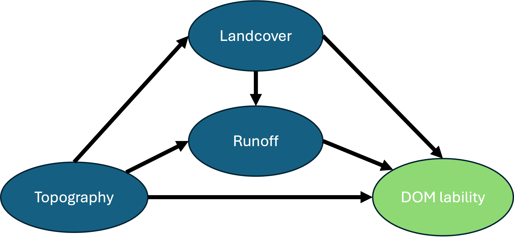

# Partial least squares – Structural Equation Modeling (PLS-SEM)

*‘PLS-SEM is capable of estimating very complex models. For example, if theoretical or conceptual assumptions support large models and sufficient data are available (i.e., meeting minimum sample size requirements), PLS-SEM can handle models of almost any size, including those with dozens of constructs and hundreds of indicator variables. As noted by Wold (1985), PLS-SEM is virtually without competition when path models with latent variables are complex in their structural relationships.’* – From Hair et al. 2021, An Introduction to SEM, pg 21<br>

Most of this material is in summary of  ‘An Introduction to Structural Equation Modeling’ by Hair et al. 2021 and from <br>
PLS Path Modeling with R. by Sanchez, G. 2013 <br>
SEMinR cran documentation at https://cran.r-project.org/web/packages/seminr/vignettes/SEMinR.html#reporting-results-of-a-bootstrapped-pls

Case studies with similar analyses: <br>
Gao, X., Qiu, L., Huang, X., Wu, M., & Cao, X. (2024). Monitoring grey water footprint and associated environmental controls in agricultural watershed. Environ Sci Pollut Res Int, 31(7), 11334-11348. https://www.ncbi.nlm.nih.gov/pubmed/38217819<br>

Kumar Gorai, A., Tuluri, F., & Tchounwou, P. B. (2015). Development of PLS–path model for understanding the role of precursors on ground level ozone concentration in Gulfport, Mississippi, USA. Atmospheric Pollution Research, 6(3), 389-397. 

#### Why PLS-SEM?
 - Works efficiently with (relatively) small sample sizes and complex models (more on this later).
 - Does not assume normal distribution of data
 - Works with formative and reflective models – but does not include circular relationships or loops


## Building the path model
We will work first with an initial model so I can define terminology. We will cover structural theory after covering vocabulary <br>



### Path diagram of our model with tested indicators
**NOTE** You may disagree with the arrangement of some of these indicators as they relate to the latent variables. That is as intended. We want to use this model to test the validity measures and demonstrate how they can guide a more logical path model. <br>

**Latent variables** are indirectly measured by means of variables which can be perfectly observed-measured. These types of variables are called manifest variables (MVs), also known as **indicators**. We use the information contained in indicators to obtain an approximate representation of the latent variable. 


**Inner Model** – Captures the relationships between latent variables (e.g., topography → landcover → runoff → DOC composition). 


The **Outer Model** Represents how the manifest variables/indicators load onto their corresponding latent variables. 

Here, we need to consider whether the lack of strong correlations within indicator sets on the "cause" side could limit the model’s explanatory power in capturing the full variance of latent variables like topography. There are checks to measure this. We will explore these after we run the model. 


**Exogeneous latent variables** only explain other constructs in the model. (e.g. Topography)  Indicators of these be called formative

**Endogeneous latent variables** are being explained in the model(Hydrological, landcover and DOM), according to Fig.1.1 in Hair et al. 2021, Indicators of these may be called reflexive variables

**Measurement theory** specifies how the latent variables are measured. Since these are unobservable variables, we can measure them with ‘reflective 'measurements (i.e., direction of the arrows is from the indicator to the latent variable) or ‘formative’ measurements (arrow is from the latent variable to the measurement, indicating that the latent variable ‘causes’ the measurement). <br>


**Structural theory** shows how the latent variables are related to one another.When the path model is developed, the sequence is from left to right, Variables on the left side of the path are independent variables, and variables on the right side are dependent. Moreover, variables on the left are show a sequentially preceding and predicting the variables on the right. When variables are in the middle of the model, the serve as both independent and dependent variables in the structural model. 


**Error terms** are connected to the endogenous constructs and (reflectively) measured indicators. Error terms represent the unexplained variance when path models are estimated. i.e. the difference between the model’s in-sample prediction of a value and an observed value of an indicator or latent variable. <br>


In contrast, the **formatively** measured indicators (like those of topography) do not have error terms. And for DOM lability, the direction of the relationships between the latent variable and indicator  are not relevant, as they are assumed to be equivalent. So, there is no error term associated with those indicators. <br>

Now that we have a path model, we need to test the theoretical relationships within that model. <br>


```{r Setup, include=FALSE}

# pkgTest is a helper function to load packages and install packages only when they are not installed yet.
pkgTest <- function(x)
{
  if (x %in% rownames(installed.packages()) == FALSE) {
    install.packages(x, dependencies= TRUE)
  }
  library(x, character.only = TRUE)
}

#"rstan", "devtools", "tidyverse",  "ggpmisc", "reshape2", 
neededPackages <- c('seminr', 'tidyr', 'dplyr', 'lubridate', 'ggplot2')

for (package in neededPackages){pkgTest(package)}

```


```{r Import_data, include = FALSE}
# IMPORT PARAFAC results
# Move up one directory from the current working directory
#file <- normalizePath(file.path(getwd(), "../PARAFAC/df_loadings.csv"))
file <- normalizePath(file.path(getwd(), "datafiles/df_loadings.csv"))
parafac <- read.csv(file, header = TRUE, sep = ",", quote = "\"",
         dec = ".", fill = TRUE) %>%
  # Widen the parafac dataframe
  #pivot_wider(names_from = Component, values_from = Proportion) %>%
  # Extract the sample no. to match other dataframe
  mutate(ID = substr(Sample, nchar(Sample) - 2, nchar(Sample)))
```

```{r Import_data2, include = FALSE}

# Move up one directory from the current working directory
file <- normalizePath(file.path(getwd(), "/datafiles/fluoro_vege_manually_corrected.csv"))

# Read the CSV file
sample_vege_fluro_topo <- read.csv(file) %>%
  dplyr::select(- c(shapefile_x, shapefile_y, shapefile, date))

```

```{r merge_dataframes, include=FALSE}
# Merge vegetation, topography and fluoro data with PARAFAC results. 
merged_df <- merge(sample_vege_fluro_topo, parafac, by='ID')%>%
  mutate(across(c(watershed, reach, position, TYPE), as.factor))%>%
  mutate(datetime = mdy_hm(datetime))

merged_df <- merged_df %>%
  mutate(
    percent_Beetle.kill = replace_na(percent_Beetle.kill, 0),
    percent_Old.Forest = replace_na(percent_Old.Forest, 0),
    percent_cut.regenerating = replace_na(percent_cut.regenerating, 0),
    percent_Tundra = replace_na(percent_Tundra, 0),
    percent_Meadows = replace_na(percent_Meadows, 0)
  )
```

```{r formatting_subsetting, include=FALSE}
# Generate a discharge column that is normalized by the area of the respective watershed.
merged_df<- merged_df%>%
  mutate(Qm3_s = replace_na(Qm3_s, 0.005))

merged_df$discharge_m2 <- merged_df$Qm3_s/merged_df$area_m

# Transform aspect from degrees to radians
merged_df$aspect_mean_rad <- merged_df$aspect_mean*pi/180

filtered_df <- merged_df %>%
  filter(position == 'stream')#%>%
  #filter(datetime >= as.POSIXct('2022-06-10 00:10') & datetime <= as.POSIXct('2022-09-15 23:00'))

filtered_df$log_discharge_m2 <- log10(filtered_df$discharge_m2)  # Adjust constant as needed

```

## Data managment / transformation

For this model demonstration, our EEMs dataset has been filtered to 'stream' samples only (no wells) (n= 91)
The selection process for these variables includes review of the specific response variable, and the correlations of that variable with the explanatory variables found in combine_PARAFAC_w_ws, part 1.B.ii. 

**1. More on size:** <br>
  **- A.10x rule:** sample size should be – to 10x the number if independent variables (number of arrows pointing to a a latent variable) (Barclay, Higgins & Thompson,  1995) <br>
		- May still be too small, depending on complexity of model. <br>
  **- B. inverse square root method** (a retrospective approach)<br>
 		-We take the path coefficient (a number showing the strength of the relationship between two variables) and divide it by its standard error (a measure of how much this coefficient might vary if the analysis is repeated).<br>
    -Compare this ratio to a critical value that depends on the significance level we’re using (e.g., 1.96 for a 5% significance level in a two-tailed test). If the ratio is greater than the critical value, it suggests the relationship (path coefficient) is statistically significant. Hair 2021 pg 17 has equations for the desired significance level, <br>
    e.g.,		\[
\text{Significance level} = 5\%: \quad n_{\text{min}} > \left( \frac{2.486}{p_{\text{min}}} \right)^2
\]
Where pmin is the value of the path coefficient with the minimum magnitude in the PLS path model. We can find that after we run the model with pls_model$path_coefs<br>

**2. Measurement scales** 
measurements should be on a metric scale, ratio or interval scale. Could also be ordinal scales if datapoints are equidistant, or with binary data. Categorical data can be binary-coded, but may need additional attention when making interpretations. See Hair et al. 2022 PLS-SEM Primer if it comes to this

**3. Missing data:**
All missing values need to be treated or removed. 
if less than 5% of values are missing per indicator, mean replacement or nearest neighbor will likely be used, depending on the nature of the missing data. We don’t have many of these. 


```{r create_model_df_demo, include=FALSE}
# Initialize model_df with the same number of rows as filtered_df
model_df <- data.frame(matrix(ncol = 0, nrow = nrow(filtered_df)))

# Define a list of constructs and their corresponding variables
indicators <- list(
  topo = c( "disttostreams_mean", "aspect_mean_rad" ,"area_m", 'twi_mean'),
  hydro = c("log_discharge_m2" ),
  landcover = c("percent_cut.regenerating", "ndvi_raster_mean"),
  doc = c("relative_load_comp_3")
)
#"slope_mean",

# Loop through each indicator and rename columns
for (indicator in names(indicators)) {
  variables <- indicators[[indicator]]
  for (i in seq_along(variables)) {
    old_name <- variables[i]
    new_name <- paste0(indicator, "_", i)
    
    # Check if the old name exists in filtered_dfand add it to model_df with the new name
    if (old_name %in% colnames(filtered_df)) {
      model_df[[new_name]] <- filtered_df[[old_name]]
    } else {
      warning(paste("Column", old_name, "not found in filtered_df"))
    }
  }
}

# Check the new column names in model_df
colnames(model_df)

```

**4. Treatment of FEF data**
These are all quantitative variables with different units and numerical ranges. We first log-transformed discharge adding 1e-9 as a constant 
Transformations are common when dealing with variables that have non-normal distributions or large ranges in ecology. Justifying transformations based on the ecological characteristics of the data (e.g., discharge typically has an exponential distribution in headwater streams) enhances the credibility of the model.
Using transformations helps to uncover meaningful ecological patterns that might be masked if extreme or skewed data overpowered the model.
In practice, documenting and justifying each transformation based on ecological knowledge of the variables strengthens the model’s interpretability and credibility. This approach allows transformations to enhance the alignment between model structure and real-world processes. 
After transforming discharge, we standardized all columns in the dataframe. Standardization transforms the variables so they have a mean of zero and a standard deviation of one. 

```{r, standardization_demo, include=FALSE, warning=FALSE, message=FALSE}
# Standardizing the environmental variables
model_df_standardized <- as.data.frame(scale(model_df, center = TRUE, scale = TRUE))
```

Let's view the scaled distributions of standardized explanatory variables:

```{r, echo=FALSE, warning=FALSE, message=FALSE, fig.cap = "Figure. Checking out the distribution of explanatory variables "}
modeldf_long <- model_df_standardized %>%
  pivot_longer(cols = everything(), names_to = "Variable", values_to = "Value")

# Plot density plots for each variable
ggplot(modeldf_long, aes(x = Value, fill = Variable)) +
  geom_density(alpha = 0.5) +  # Add transparency for overlapping densities
  facet_wrap(~ Variable, scales = "free", ncol = 2) +  # Create separate panels per variable
  theme_minimal() +
  labs(title = "Density Plots for Modeled Variables",
       x = "Value", y = "Density")
```

Build the outer model or 'constructs' or latent variables

```{r, outermodel_demo}

simple_FEF_mm <- constructs(
  composite("TOPO", multi_items("topo_", 1:4)),
  composite("HYDRO", single_item("hydro_1")),
  composite("LANDCOVER", multi_items("landcover_", 1:2)),
  composite("DOC", single_item('doc_1'))
)

```

Now for the structural model:

```{r, innermodel_demo}
# Create structural model
simple_FEF_sm <- relationships(
paths(from = c("TOPO"), to = c("HYDRO", "LANDCOVER", "DOC")),
paths(from = c("LANDCOVER"), to = c("HYDRO", "DOC")),
paths(from = c("HYDRO"), to = c("DOC")))

# Note that neither a dataset nor a measurement model is specified in the structural model stage, so we can reuse the structural model object simple_sm across different datasets and measurement models.
```

Model Estimation using the PLS-SEM algorithm. The algorithm needs to determine the scores of the constructs that are used as input for partial regression models within the path model. After the algorithm has calculated the construct scores, the scores are used to estimate each partial regression model in the path model. As a result, we obtain the estimates for all relationships in the measurement models (i.e., the indicator weights/loadings) and the structural model (i.e., the path coefficients). (more on pg 60 of Hair)

```{r, include=FALSE}
# Estimate the model
fef_simple_model <- estimate_pls(data = model_df_standardized,
measurement_model = simple_FEF_mm,
structural_model = simple_FEF_sm,
inner_weights = path_weighting,
missing = mean_replacement,
missing_value = "NA")
```

summarize output
```{r, include = FALSE}
# Summarize the model results
summary_simple_fef <- summary(fef_simple_model)

# Inspect the model’s path coefficients and the R^2 values
print(summary_simple_fef)
```

## Reporting initial results and evaluating the quality of reflective measurement models 
estimated by PLS-SEM both in terms of reliability and validity.

A plot of result reliability measures:
```{r}
plot(summary_simple_fef$reliability)
```


1. Indicator reliability:
First we want to know how much of each indicator's variance is explained by the latent variable it is assigned to. 
'To compute an indicator’s explained variance, we need to square the indicator loading, which is the bivariate correlation between indicator and construct. As such, the indicator reliability indicates the communality of an indicator. Indicator loadings above 0.708 are recommended, since they indicate that the construct explains more than 50 percent of the indicator’s variance, thus providing acceptable indicator reliability.' Hair et al. 2021

```{r, echo=FALSE}
#Inspect the indicator reliability
summary_simple_fef$loadings^2
```

Take home: Our current topo_3 (subwatershed area in m^2) as a low reliability which can contribute to more measurement error to the model, which can weaken the model’s validity and interpretability. This means that less than 50% of it's variance is explained by other 'topography' indicators, which makes sense. topo_3 represents watershed area may be a better variable to group with 'hydrology' rather than topograhy. We'll test this along with other model variations in the next chapter. 

2. Then we want to check the 'internal consistency reliability' (rhoC). Internal consistency reliability is the extent to which indicators measuring the same construct are associated with each other.
'Higher values indicate higher levels of reliability. For example, reliability values between 0.60 and 0.70 are considered “acceptable in exploratory research,” whereas values between 0.70 and 0.90 range from “satisfactory to good.” Values above 0.90 (and definitely above 0.95) are problematic, since they indicate that the indicators are redundant, thereby reducing construct validity (Diamantopoulos, Sarstedt, Fuchs, Wilczynski, & Kaiser, 2012).'Hair et al. 2021  Other sources indicate that 0.85 is a more conservative threshold value. 

```{r, echo=FALSE}
print(summary_simple_fef$reliability)
```

Our rhoC values fall in the higher (not ideal) range of 'satisfactory to good' but our 'problematic' values are due to these latent values having single indicators, so they aren't truly problematic.

3. Convergent Validity:<br>
When we assess convergent validity, we're checking how well each indicator represents the latent variable it's supposed to measure. For convergent validity, we want to see if the indicators of the same latent variable are closely related rather than explaining different processes. This is where average variance extracted (AVE) comes in:

- AVE shows how much of the total variance in the indicators is actually explained by the construct.

```{r, echo=FALSE}
print(summary_simple_fef$reliability)
```

Here then we should not be surprised to see 1.00 for HYDRO and DOC AVE, as, up to this point, we have included only one indicator for these latent variables. However, for topo and landcover, we can be confident that we have chosen variables that are measuring the same thing as our AVE are high (over 0.5)

4. Discriminant Validity<br>
Now we want to make sure that different latent variables in the model are distinct from each other, ie. they measure different concepts. One way to check this is by using the heterotrait–monotrait (HTMT) ratio.

If the HTMT values are low (typically below 0.9), it indicates that the constructs are distinct and measure different concepts.


```{r, echo=FALSE}
print(summary_simple_fef$validity$htmt)
```

In this current configuration, topo and landcover may not be distinct. This is hardly surprising, landcover indicators are often directly and strongly correlated with many of the topographical variables. In this case, we are looking at the percentage of each subwatershed that is covered by 'cut/regenerating' forest. Many of these sites were on lower slopes (likely for ease of access), and in the case of Deadhorse, almost entirely on the southern aspect. Furthermore, 'TWI' or the total wetness index likely drives NDVI. A high correlation between topography and landcover in our SEM model isn't necessarily problematic if it aligns with the underlying ecology of the study area
Combining them into a single latent variable isn't ideal for our research question, where we want to see if we can evaluate the impacts of land cover independent of topography. We may not have this issue if we look at other land cover types. Let's come back to this to see if it needs addressing. We might be able to control for one construct in relation to the other, such as controlling for topography when examining landcover’s effect, to clarify their roles without removing one or the other. 

## Bootstrapping for significance

PLS-SEM is a nonparametric method – thus, we need to perform bootstrapping to estimate standard errors and compute confidence intervals.

Here we'll use the bootstrap_model() function and specify the arguments seminr_model = corp_rep_simple_model, nboot = 1000, cores = NULL, seed = 123. In other words, we use 1,000 bootstrap subsamples. However, the final result computations should draw on 10,000 subsamples (Streukens & Leroi-Werelds, 2016). These computations will take a while so we will do them after exploring other model configurations.   

```{r, include=FALSE}
# Bootstrap the model
boot_simple_fef <- bootstrap_model(seminr_model = fef_simple_model,
nboot = 1000,
cores = NULL,
seed = 123)
# Store the summary of the bootstrapped model
sum_boot_simple_fef <- summary(boot_simple_fef)
```

```{r, include=FALSE}
# Write the bootstrapped paths object to csv file
#write.csv(x = sum_boot_simple_fef$bootstrapped_loadings,
#file = "boot_loadings.csv")
```

## Reporting results of bootstrapped PLS

```{r}
# Extract the bootstrapped HTMT
sum_boot_fef <- summary(boot_simple_fef, alpha= 0.10)

sum_boot_fef$bootstrapped_HTMT
```

This gives us the confidence intervals of the HTMT ratio. Again, our bootstrapped HTMT ratio indicating the high correlation between topography and landcover. 

The bootstrapping procedure yields t-values for the indicator weights (and other model parameters). We need to compare these t-values with the critical values from the standard normal distribution to decide whether the coefficients are significantly different from zero. Assuming a significance level of 5%, a t-value above 1.96 (two-tailed test) suggests that the indicator weight is statistically significant. 

```{r, include=FALSE}
# Inspect the bootstrapped structural paths
sum_boot_simple_fef$bootstrapped_paths
# Inspect the bootstrapped indicator loadings
sum_boot_simple_fef$bootstrapped_loadings
```

```{r, echo=FALSE, message=FALSE, warning=FALSE, fig.width=8, fig.height=4}
# generate a small model for creating the plot
# recall that constructs are stored in simple_FEF_mm
# and the structural model is stored in simple_FEF_sm
# and the model estimation is in fef_simple_model

# bootstrap results in boot_simple_fef
# Save the original graphical parameters
old_par <- par()  

# Change 'cex' for larger text size
par(cex = 0.5)  


plot(boot_simple_fef, title = "Bootstrapped Model")
par(old_par)  # Reset to default after
#save_plot("myfigure.png")
```

Interpretation:
As an example between Landcover and DOC B = -0.068: This is the standardized path coefficient between the two latent variables. A negative value (-0.068) indicates a weak negative relationship, meaning that as one variable increases slightly, the other decreases slightly, though the effect is minimal here.
95% CI [-0.332, 0.261]: This is the 95% confidence interval for the beta value, giving a range within which the true beta value is likely to fall, with 95% confidence. Since this interval includes zero (spanning from -0.332 to 0.261), the effect of landcover on DOC here could be statistically insignificant. 
So, in this current configuration, the standardized path coefficients between TOPO and LANDCOVER are significant and TOPO and DOC are significant (as our TOPO indicator variables increase, the fragment of DOC that is protein-like increases), but as the model is organized now, the effect of Landcover and hydrology are minimal and not significant. 

```{r}

```


