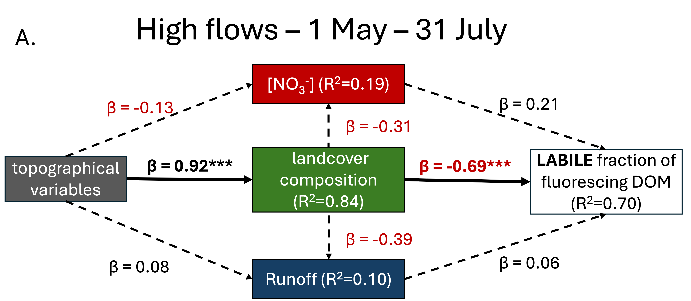

# Final model pngs

```{r, include=FALSE}
# pkgTest is a helper function to load packages and install packages only when they are not installed yet.
pkgTest <- function(x)
{
  if (x %in% rownames(installed.packages()) == FALSE) {
    install.packages(x, dependencies= TRUE)
  }
  library(x, character.only = TRUE)
}

#"rstan", "devtools", "tidyverse",  "ggpmisc", "reshape2", 
neededPackages <- c('seminr', 'tidyr', 'dplyr', 'lubridate', 'ggplot2')

for (package in neededPackages){pkgTest(package)}
```

# Viewing reconstructed 'best fitting' models

This script contains recreations of models that explain the most variability in labile and humic DOM. The intent is to generate images that are quickly interpretable for posters, presentations or papers. 

## Model 1: 


Figure: PLS-SEM models depicting the effects of four variables on the humic fraction of fluorescing DOM in high flows (a) and low flows (b). The beta coefficients (β) in each relationship indicates the strength of the relationship between latent variables. Negative relationships are shown in red, positive relationships are printed in black, with significant relationships in bold text and asterisks to indicate level of significance. A negative β indicates that as the latent variable increases the dependent latent variable decreases. The coefficient of determination (R2) represents the proportion of variance in the latent variable explained by the variables (latent or observed). Higher R2 values indicate a better ability of the model to explain the variance in the latent variable. 

In this high-flow to low-flow comparison, we see that topography has a strong reinforcing effect on landcover composition, which in this model is characterized by the % coverage of harvested and regenerating forest, and the % of beetle kill affected forest. In high flows, the humic fraction of fluorescing DOM is strong and positive, indicating that as the % of beetle kill and regenerating forest increase, humic fractions increase. In low flows,the humic fraction of DOM decreases as NO3- concentration in the water sample increases. This could be an indication that NO3- is being allochthonously utilized by microbial communities to oxidize and polymerize carbon (increasing humic fractions) rather than being transported to the stream channel. 

## Model 2: 




Figure: PLS-SEM models depicting the effects of four variables on the protein-like fraction of fluorescing DOM in high flows (a) and low flows (b). The beta coefficients (β) in each relationship indicates the strength of the relationship between latent variables.

In this high-flow to low-flow comparison, we see that topography has a strong reinforcing effect on landcover composition, which in this model is characterized by the % coverage of harvested and regenerating forest, and the % of beetle kill affected forest. In high flows, the protein-like (labile) fraction of fluorescing DOM is strong and negative, indicating that as the % of beetle kill and regenerating forest decrease, labile fractions increase. In low flows, NO3- has a significant positive influence on the labile fraction, as the labile fraction of DOM increases as NO3- concentration in the water sample increases. 